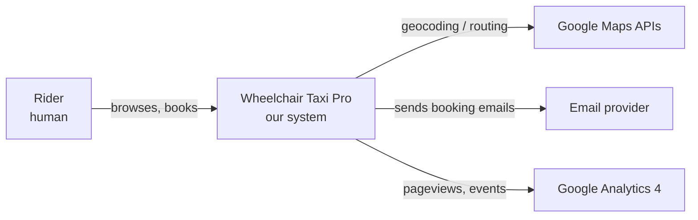

# C4 Model — what it is and how we use it

> [繁體中文版 (zh-HK)](c4-model-primer.zh-HK.md) | [Master Index](../00-index.md)

## Table of contents

<!-- TODO: fill in during Phase 1. -->

---

## Status

This primer is a **stub**. Full content will be written in **Phase 1** of the approved plan.

## One-line definition

The **C4 Model** describes a software architecture at **four zoom levels** — Context, Container, Component, and Code — so readers can pick the altitude that matches their question.

## The four zoom levels

| Level | Name | What it shows | Typical audience |
|---|---|---|---|
| 1 | **Context** | Your system as a single box among users and external systems | Stakeholders, executives, new joiners |
| 2 | **Container** | The deployable / runtime units inside your system (frontend, API, DB, mail, etc.) | Tech leads, ops, new developers |
| 3 | **Component** | The internal structure of one container (modules, services, classes grouped logically) | Developers working on that container |
| 4 | **Code** | A class diagram / code listing for one component | Rarely needed; usually skipped in favour of the code itself |

We use L1 in [§3 Context and Scope](../03-context-and-scope.md), L2 + L3 in [§5 Building Block View](../05-building-block-view.md), and L3 deployment in [§7 Deployment View](../07-deployment-view.md). **We skip Level 4** — the code is the code.

## Why C4

- **Abstraction-first**, notation-last — readers always know the zoom level first.
- **Tool-agnostic** — works with PlantUML, Structurizr, draw.io, or plain Mermaid. We use **Mermaid** because it renders natively on GitHub and inside GitHub-flavoured markdown.
- **Simple vocabulary** — only four concepts (Person, Software System, Container, Component) and a handful of relationship types.

## Mermaid conventions we follow

- Every diagram opens with a one-line heading ("Figure N — …") for accessibility and cross-reference.
- Nodes use camelCase / PascalCase IDs (no spaces — Mermaid parser requirement).
- Edge labels containing parentheses are quoted: `A -->|"HTTP (JSON)"| B`.
- We do **not** set explicit colours; the default theme handles light / dark mode.
- No click-through event handlers (disabled for security).

## Example — C4 Level 1 sketch (what §3 will contain)

(The real §3 diagram will include GSC, GBP, Facebook, and the dispatcher mailbox as separate actors.)

## Further reading

- Official site: [c4model.com](https://c4model.com/)
- Creator's book: [Software Architecture for Developers](https://leanpub.com/b/software-architecture), Simon Brown
- Mermaid syntax: [mermaid.js.org](https://mermaid.js.org/)

<!-- When you add/rename a heading, update the Table of contents above. -->
