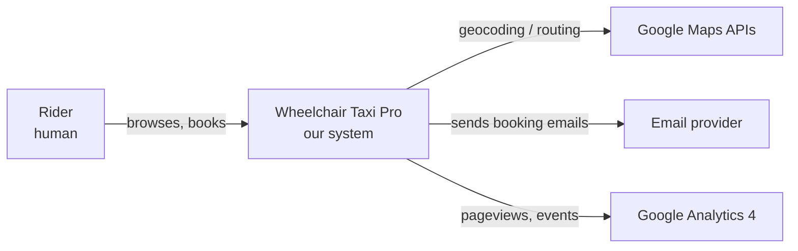

# C4 模型 — 是甚麼，我們如何使用

> [English version](c4-model-primer.md) | [主目錄](../00-index.zh-HK.md)

## 目錄

<!-- TODO：於 Phase 1 撰寫時填寫。 -->

---

## 狀態

本導讀為 **草稿 (stub)**。完整內容將於已核准計劃的 **Phase 1** 撰寫。

## 一句話定義

**C4 模型** 以 **四個縮放層級** 描述軟件架構 — Context（情境）、Container（容器）、Component（元件）、Code（程式碼）— 讓讀者按需要選擇合適的視角。

## 四個縮放層級

| 層級 | 名稱 | 所展示內容 | 典型受眾 |
|---|---|---|---|
| 1 | **Context 情境** | 以單一方格代表本系統，與用戶及外部系統並置 | 持份者、管理層、新加入者 |
| 2 | **Container 容器** | 本系統內部的可部署／運行單元（前端、API、資料庫、電郵等） | 技術主管、運維、新開發者 |
| 3 | **Component 元件** | 單一容器內的模組／服務／類別結構 | 負責該容器的開發者 |
| 4 | **Code 程式碼** | 單一元件的類別圖或程式碼清單 | 很少需要；通常直接閱讀程式碼即可 |

我們於 [§3 情境與範圍](../03-context-and-scope.zh-HK.md) 使用 L1、於 [§5 建構塊視圖](../05-building-block-view.zh-HK.md) 使用 L2 + L3、於 [§7 部署視圖](../07-deployment-view.zh-HK.md) 使用 L3 部署層面。**不使用 Level 4** — 程式碼本身已足夠。

## 為何採用 C4

- **以抽象優先，符號其次** — 讀者先確定縮放層級，再看細節。
- **工具中立** — 可用 PlantUML、Structurizr、draw.io 或純 Mermaid。我們選用 **Mermaid**，因其在 GitHub 及 GitHub 風格 Markdown 原生渲染。
- **詞彙簡潔** — 只有四個核心概念 (Person、Software System、Container、Component) 及少量關係類型。

## 我們採用的 Mermaid 慣例

- 每幅圖均以單行標題開首（"Figure N — …"），方便無障礙與跨檔引用。
- 節點使用 camelCase / PascalCase 識別符（不能含空格 — Mermaid 語法要求）。
- 邊標籤若含括號需加引號：`A -->|"HTTP (JSON)"| B`
- 我們 **不** 指定顏色；預設主題會自動處理明／暗模式。
- 不使用 click 跳轉事件（出於安全已停用）。

## 範例 — C4 Level 1 草圖（§3 最終內容）

（§3 的最終圖將把 GSC、GBP、Facebook 及調度郵箱作為獨立角色一併加入。）

## 延伸閱讀

- 官方網站：[c4model.com](https://c4model.com/)
- 作者著作：[Software Architecture for Developers](https://leanpub.com/b/software-architecture)，Simon Brown
- Mermaid 語法：[mermaid.js.org](https://mermaid.js.org/)

<!-- 新增或更名標題時，請同步更新上方目錄。 -->
