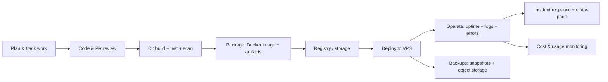
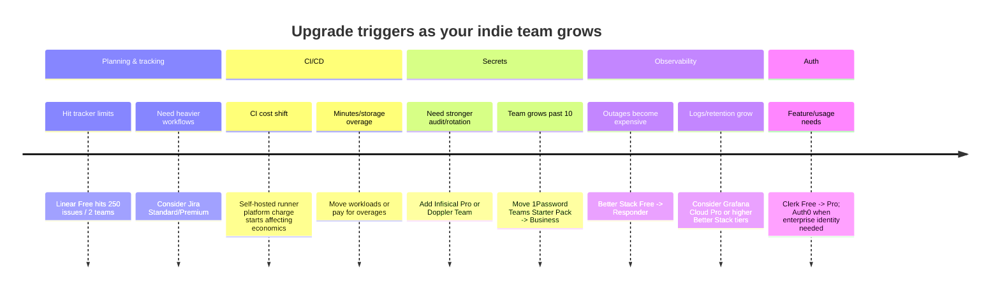

# Full software lifecycle tooling for a small indie team on GitHub Actions, Docker, VPS, and Cloudflare

## Executive summary

For a 1–5 person indie team shipping production .NET + Angular apps on Docker to a VPS (Hong Kong or Singapore) with GitHub Actions, the most cost-effective pattern is to keep the “inner loop” (planning → code → CI → registry) as GitHub-native as possible, then buy a small set of focused production-grade subscriptions for security, secrets, and observability. This avoids tool sprawl while still covering the full lifecycle.

A strong “production baseline” subscription set looks like:

- Source control + CI/CD + issues/projects: **entity["company","GitHub","code hosting platform"] Team** (seat-based, low cost; integrates natively with GitHub Actions). citeturn0search0turn7search1  
- DNS/CDN/WAF + domain integration: **entity["company","Cloudflare","cdn and dns provider"] Free → Pro** depending on whether you need Pro-grade security/performance features. citeturn0search18  
- Passwords + shared human secrets: **entity["company","1Password","password manager vendor"] Teams Starter Pack** (flat price up to 10 users) or Business (per user) when you outgrow 10 seats or need deeper IdP integrations. citeturn19view0  
- Runtime secrets distribution (optional but powerful): **entity["company","Infisical","secrets management company"] Free (covers up to 5 identities) → Pro when you need advanced controls/recovery/SSO. citeturn19view3  
- Error tracking and performance troubleshooting: **entity["company","Sentry","error monitoring company"] Team** (priced for teams; not per-seat). citeturn16view0turn15search6  
- Uptime + incident response + status page + logs in one platform: **entity["company","Better Stack","observability platform"] Free → Responder** once you need on-call/phone alerts and richer incident workflows. citeturn16view2turn15search5turn15search30  
- Customer authentication (if you don’t want to build/operate auth yourself): **entity["company","Clerk","authentication provider"] Free → Pro** as you need more production features and/or usage grows. citeturn21search0turn21search4  

A realistic *fixed-cost* budget for a 3-person team (excluding usage-based storage/egress and excluding VPS compute if you treat infra separately) is typically about **US$85–US$125/month** for “production baseline” SaaS, depending mainly on whether you buy Cloudflare Pro and whether you move Better Stack beyond free. (A worked bundle estimate is provided later.)

On “should I use Jira?”—for a 1–5 person indie team already centred on GitHub Actions, Jira usually only becomes worth the overhead when you need heavier workflow customisation, large-scale planning templates, or cross-team governance. Jira’s pricing can be materially higher than GitHub-native issues/projects or Linear for small teams (details cited below). citeturn10search0turn9view0turn0search0

## Lifecycle blueprint for GitHub Actions + Docker + VPS

A pragmatic lifecycle for your stack is:

- Plan + track work (issues, roadmap, sprint-like cadence)
- Code + review (branch protections, code ownership, required checks)
- Build/test in CI (unit/integration tests; security and quality gates)
- Package (Docker images + release artifacts)
- Deploy (push images, pull on VPS, run migrations, restart services)
- Operate (uptime, logs, errors, auditing, backups, cost watch)

The toolchain below is the “reference flow” that the rest of this report maps tools onto (tool choices impact *how* each box is implemented—CI runner type, registry choice, secrets delivery method, etc.). citeturn7search8turn7search19turn0search4turn0search2

Two stack-specific considerations to highlight early:

- **Self-hosted GitHub Actions runners have a new platform charge (from March 1, 2026)**, which affects the “run CI on your own VPS” cost model; don’t assume “self-hosted is free” anymore. citeturn0search8  
- Your compute region choices—**entity["place","Hong Kong","hong kong, china"]** and **entity["place","Singapore","singapore"]**—favour low latency for users in East/Southeast Asia, but you should keep logs/backups/auth/vendor regions in mind for data locality and latency to your ops team in **entity["country","New Zealand","new zealand"]**. (More on this later.) citeturn3view2turn15search0turn16view2  

## Curated tools and pricing by lifecycle stage

This section gives a curated shortlist (not exhaustive) for each lifecycle stage and then details **official tiers, costs, limits, and a recommended tier for a 1–5 person production team**. If an official detail is not available from the sources retrieved here, it is marked **unspecified**.

### Comparison table of candidates and recommended tiers

All prices are as shown on vendor pricing pages (typically USD unless noted; “annual” is either vendor-stated or computed as monthly×12). Usage-based services are shown as “variable”. citeturn0search0turn0search18turn16view0turn16view2turn19view0turn21search0turn21search2turn23view0turn23view2turn9view0turn10search0turn11view1  

| Lifecycle stage | Tool candidates | Recommended for 1–5 building production | Why this tier (short justification) |
|---|---|---|---|
| Planning + issue tracking | GitHub Issues/Projects; Linear; Jira | GitHub (Team or Free depending on governance needs); Linear Basic if you want a dedicated PM UX | GitHub-native minimises context switching; Linear Basic removes Free limits (250 issues) while staying lightweight. citeturn0search0turn9view0turn10search0 |
| Docs / internal wiki (often paired with planning) | Notion; GitHub Markdown/wiki; Confluence (not fully researched here) | Notion Plus if you want a hosted wiki; otherwise GitHub Markdown/wiki | Notion Free has file and history constraints; Plus removes key friction for teams. citeturn9view3 |
| Source hosting + PR review | GitHub | GitHub Team | Low per-seat cost; fits GitHub Actions/Packages cleanly. citeturn0search0turn7search5turn7search8 |
| CI/CD | GitHub Actions | Built-in; choose GitHub-hosted runners first; self-hosted runners only when justified | Avoid surprise costs: self-hosted runners now have a platform charge; GitHub-hosted billing is well-defined. citeturn0search8turn0search4 |
| Container registry | GHCR (via GitHub Packages); DigitalOcean Container Registry; Docker Hub | Start with GHCR; consider DO registry if you already pay for DO and want separation | GHCR is “closest” to Actions; DO registry is usage-priced; Docker Hub adds per-seat costs. citeturn0search2turn4view2turn21search3 |
| Artifact storage (releases, backups, large binaries) | Cloudflare R2; Backblaze B2; Wasabi | Cloudflare R2 for app assets near Cloudflare; Backblaze B2 for low-cost backup storage | R2 has no egress fees and clear op-based pricing; B2 is US$6/TB/mo and has free 3× egress. citeturn21search2turn21search18turn23view0turn23view1 |
| Secrets management | GitHub Secrets; 1Password; Infisical; Doppler | 1Password Teams Starter Pack + GitHub Secrets; use Infisical Free/Pro if you want runtime/rotation | 1Password gives strong human+shared secret handling; Infisical Free covers up to 5 identities; Doppler is powerful but pricier per seat. citeturn19view0turn19view3turn20view1 |
| Testing/QA + code quality | SonarQube Cloud; Snyk; Codecov; BrowserStack | Start with free tiers; add Sonar Team / Snyk Team / BrowserStack only when triggers hit | Free tiers are substantial; pay when you need private code size, scan volume, or real device coverage. citeturn13view0turn13view1turn13view2turn14view0turn14view3 |
| Monitoring + logging | Better Stack; Grafana Cloud | Better Stack Free → Responder; Grafana Cloud Free → Pro if you adopt full OTel metrics/logs/traces | Better Stack bundles uptime+logs+incidents; Grafana Cloud is powerful but usage-priced and can grow unpredictably. citeturn16view2turn16view3turn15search4 |
| Error tracking | Sentry | Sentry Team | Designed for teams; includes unlimited users and integrations at Team tier. citeturn16view0turn15search6 |
| Uptime | Better Stack; UptimeRobot | Better Stack (already in bundle) or UptimeRobot Free/Solo | UptimeRobot free includes 50 monitors; Better Stack already covers uptime + incidents + status. citeturn16view2turn17view2turn15search5 |
| App auth (customer login/SSO) | Clerk; Auth0 | Clerk Free → Pro for most indie products; Auth0 when you need enterprise-heavy features and accept higher cost | Clerk’s free allowance is exceptionally large; Auth0’s self-serve starts higher and ramps with MAUs. citeturn21search0turn21search4turn21search1turn21search5 |
| Backups | DO backups/snapshots; Vultr backups/snapshots; object storage | DO or Vultr native backups + object storage copy (R2/B2) | Native snapshots are simple; object storage adds ransomware/accident resilience and longer retention. citeturn3view2turn2search1turn2search17turn23view0turn21search2 |
| Cost management | Vantage; CloudForecast | Vantage Starter (Free) | Vantage has clear low-cost tiers; CloudForecast pricing appears inconsistent on its own pricing page (treat as risky/verify). citeturn23view2turn23view3 |

### Planning and issue tracking

**Linear (official tiers and limits)**  
Linear tiers and limits are clearly stated on its pricing page: Free includes unlimited members but is limited to **2 teams** and **250 issues**; Basic is **US$10 per user/month billed yearly**; Business is **US$16 per user/month billed yearly**; Enterprise is custom and annual-only. citeturn9view0  
Recommended tier for 1–5 in production: **Basic** if you want a dedicated product/engineering tracker separate from GitHub, because it removes the hard Free caps (250 issues / 2 teams) that many teams hit as soon as a product matures. citeturn9view0  
Cost (1–5 people): US$10×seats/month equivalent (annual billed), i.e., US$120/user/year. citeturn9view0  

**Jira (official tier prices; feature references partially available)**  
The Jira pricing page snippet shows: Free is “free forever” for **10 users**, Standard is **US$7.91 per user/month**, Premium is **US$14.54 per user/month** (Enterprise unspecified). citeturn10search0  
A separate official page describes Premium differentiators like **99.9% uptime SLA**, **unlimited storage**, and **24/7 Premium Support**, and also shows the Standard storage figure of **250 GB**. citeturn10search14  
Recommended tier for 1–5 in production: **Free** *unless* you specifically need Jira’s advanced administration, permissions, or Premium-tier guarantees. Jira is excellent, but for GitHub-centred indie teams it can add workflow overhead. citeturn10search0turn0search0  
Annual cost estimate for Standard: US$7.91×12 = **US$94.92/user/year** (computed). citeturn10search0  

**Trello (official tiers and limits)**  
Trello pricing is explicit: Free is **US$0** (up to **10 collaborators per Workspace**) and includes up to **10 boards**; Standard is **US$5/user/month if billed annually** (US$6 billed monthly); Premium is **US$10/user/month if billed annually** (US$12.50 billed monthly); Enterprise is **US$17.50/user/month billed annually** (US$210 annual price per user). citeturn11view1  
Recommended tier for 1–5 in production: **Standard** only if you are intentionally choosing Trello as your main tracker (unlimited boards + more automation), otherwise GitHub/Linear is usually a better fit for dev-centric workflows. citeturn11view1turn0search0turn9view0  

### Documentation and internal knowledge base

**Notion (official tiers and limits)**  
Notion’s pricing page shows: Free is **US$0 per seat/month**; Plus is **US$10 per seat/month**; Business is **US$20 per seat/month** (Enterprise is “contact us”). citeturn9view3  
Limits shown: Free file uploads are **up to 5 MB**; paid plans allow “unlimited” file uploads with a ~5GB max per file; page history is **7 days (Free)**, **30 days (Plus)**, **90 days (Business)**, unlimited (Enterprise). citeturn9view3  
Recommended tier for a 1–5 production team: **Plus** if Notion is your operational wiki (runbooks, incident notes, onboarding), because Free’s upload and history constraints are real friction once you store diagrams, PDFs, and architecture docs. citeturn9view3turn16view2  

### Code hosting and CI/CD

**GitHub plan (official price; CI/CD billing exists separately)**  
GitHub’s pricing page lists Team at **US$4 per user/month**. citeturn0search0  
GitHub’s docs explain that GitHub Actions usage is free for public repos on standard GitHub-hosted runners and for self-hosted runners, and that private repos have free minutes/storage quotas by plan with overage billing beyond included amounts. citeturn7search1turn0search4  

**Important 2026 change: self-hosted runner “platform charge”**  
GitHub’s changelog indicates that a self-hosted runner platform charge applies from **March 1, 2026**. This directly affects the economics of “run everything on a self-hosted runner on your VPS.” citeturn0search8  

Recommended tier for 1–5 production apps: **GitHub Team** if you want organisation-grade controls and predictable collaboration governance at low cost. If budget is extremely tight, start on Free and upgrade when you need stronger controls or start hitting Actions/package quotas. citeturn0search0turn0search4  

### Container registry and artifact storage

**GitHub Packages / GHCR**  
GitHub’s billing documentation for Packages describes billing based on **storage and data transfer** for packages, with details depending on plan and usage. citeturn0search2  
Recommendation: For small teams already on GitHub Actions, start with GHCR because it minimises moving parts; shift registries only if you need cost isolation, regional separation, or faster pulls near your VPS region. citeturn0search2turn3view2  

**DigitalOcean Container Registry (usage-based pricing)**  
DigitalOcean describes container registry pricing as usage-based: **US$0.0000185 per GiB-hour** for storage and **US$0.015 per GiB** for data transfer. citeturn4view2  
Recommended tier: **Use it when you want registry separation from GitHub**, or when DO networking makes pulls cheaper/simpler for DO-hosted workloads (otherwise GHCR is usually fine). citeturn4view2turn0search2  

### Secrets management

This is where most indie teams underinvest early and then pay for it later (credential leaks, inconsistent environment configs, manual rotation, unknown “who had access”).

**1Password (Teams Starter Pack vs Business)**  
1Password’s small business page states:  
- **Teams Starter Pack**: **US$19.95/month**, **up to 10 users**, paid annually. citeturn19view0  
- **Business**: **US$7.99 per user/month**, paid annually (and includes additional features like IdP integrations—Okta, Entra ID, OneLogin, Duo, etc.). citeturn19view0  

Recommended tier for 1–5: **Teams Starter Pack** (flat rate is hard to beat up to 10 people). Move to Business when you exceed 10 users or need deeper IdP/admin controls. citeturn19view0  
Annual cost: US$19.95×12 = **US$239.40/year** (computed) for Teams Starter Pack. citeturn19view0  

**Infisical (Free vs Pro vs Enterprise)**  
Infisical’s pricing page states (Secrets Manager line):  
- **Free**: **US$0/mo**, identity limit **up to 5**, project limit **up to 3**, integration limit **up to 10**. citeturn19view3  
- **Pro**: **US$18/mo for 1 identity**, includes features like secret versioning, point-in-time recovery, RBAC, secret rotation, SAML SSO, IP allowlisting, and 90-day audit log retention. citeturn19view3  
- **Enterprise**: custom pricing with advanced enterprise controls. citeturn19view3  

Recommended tier for 1–5: **Free** is unusually viable (it literally matches your team size ceiling). Move to **Pro** when you need the Pro-only controls (notably SAML SSO, stronger retention/recovery, and more environments/integrations). citeturn19view3  

**Doppler (Developer vs Team vs Enterprise)**  
Doppler’s pricing page states:  
- **Developer**: free for **3 users**, then **US$8/mo per additional user**. citeturn20view1  
- **Team**: **US$21/mo per user**; includes SAML SSO, RBAC, 90 days of activity logs, secret rotation, config inheritance, trusted IPs and priority support; config syncs limit shown as **100**. citeturn20view1  
- **Enterprise**: custom pricing. citeturn20view1  

Recommended tier for 1–5: **Developer** if you’re under 3 human users; otherwise Doppler becomes relatively expensive per-seat compared with Infisical’s Free/Pro and 1Password’s flat Teams Starter Pack. Doppler Team earns its cost if you specifically need its workflow model and CI/runtime sync patterns. citeturn20view1turn19view3turn19view0  

### Testing/QA and code quality

**SonarQube Cloud (free tier + paid pricing model)**  
Sonar’s official pricing page explains:  
- A **free tier** exists for private projects up to **50k LoC**. citeturn13view0  
- Team plan pricing **starts at €30/month** for up to **100k LoC**, with larger LoC increments available. citeturn13view0  

Recommended tier for 1–5: **Free** until you cross 50k LoC or want paid-tier features; then **Team** is the normal indie upgrade because it stays predictable via LoC-based pricing. citeturn13view0  
Currency note: this item is EUR-denominated on the vendor page. citeturn13view0  

**Snyk (scan-volume-based limits across products)**  
Snyk’s plans page shows “Free” and “Team” (and higher tiers) and includes explicit monthly test limits, for example:  
- Snyk Open Source tests/month: **200 (Free)** vs **1000 (Team)**. citeturn13view1  
- Snyk Code (SAST) tests/month: **100 (Free)** vs **up to 1000 (Team)**. citeturn13view1  
- Snyk Container tests/month: **100 (Free)** vs **unlimited (Team)**. citeturn13view1  
The pricing headline indicates Team starts “from **$25/month**” (with details controlled by plan selection). citeturn12search1turn13view1  

Recommended tier for 1–5: **Free** early; upgrade to **Team** once scan limits become a bottleneck or you want broader team workflows. citeturn13view1  

**Codecov (coverage reporting)**  
Codecov’s pricing page shows: Developer is **Free**, Team is **US$5 per user/month**, Pro is **US$12 per user/month**, Enterprise is custom. citeturn13view2  
Recommended tier for 1–5: **Developer (Free)** until you specifically need Team/Pro features (for many indie teams, Free coverage reporting is sufficient). citeturn13view2  

**BrowserStack (cross-browser/device testing; optional)**  
BrowserStack’s pricing page shows:  
- Live “Desktop” is **US$29/month billed annually** (single user plan). citeturn14view0turn14view2  
- Automate “Chrome Desktop” starts at **US$59/month billed annually** (for 1 parallel test). citeturn14view3turn14view1  

Recommended tier for 1–5: **Buy only when you have evidence you need real device/browser coverage** that you cannot cheaply replicate with Playwright + a smaller internal browser stack. BrowserStack is valuable, but it’s rarely an early “must-have” unless your product is highly UI/browser sensitive. citeturn14view0turn14view3  

### Monitoring, logging, error tracking, uptime

**Better Stack (bundled ops platform)**  
Better Stack’s pricing page lists a strong Free tier, explicitly including: **10 monitors & heartbeats**, **1 status page**, Slack/email alerts, plus quotas for logs/events. citeturn16view2turn15search5  
It also shows the entry paid model: **Responder** at **US$34 per license per month** (monthly) or **US$29 per license per month** (annual). It also indicates “Unlimited team members” and “Free access to Telemetry” (member pricing shown as US$0/member/month). citeturn16view2  

Recommended tier for 1–5 production:  
- Start on **Free** if you can tolerate Slack/email-only paging and short log retention. citeturn16view2  
- Move to **Responder (at least 1 licence)** once outages matter enough that you need robust on-call escalation (phone/SMS) and more structured incident management. citeturn16view2  

**Grafana Cloud (observability à la carte; usage-based)**  
Grafana’s pricing page is explicit about both free allowances and usage pricing:  
- Metrics Free includes **10k active series** and **14-day retention**; Pro is **US$6.50 per 1k series** plus a **US$19/month platform fee** with longer retention and support. citeturn16view3  
- Logs Free includes **50 GB ingested/month** with **14-day retention**; Pro includes that allowance plus pay-as-you-go and a **US$19/month platform fee** (and 30-day retention). citeturn16view3  

Recommended tier for 1–5 production: **Free** until your metrics/logs volume or retention needs exceed the free allowances. Grafana Cloud becomes excellent when you commit to OpenTelemetry everywhere and want a unified metrics/logs/traces pipeline—but watch usage growth. citeturn16view3turn15search4  

**Sentry (error+performance troubleshooting)**  
Sentry’s pricing page states:  
- Developer: **Free**, limited to **one user**. citeturn16view0  
- Team: **US$26/mo** (shown as “when billed annually with default pre-paid data”) and includes unlimited users, integrations, and more dashboards. citeturn16view0  
- Business: **US$80/mo** (billed annually with default pre-paid data) with additional features like SAML+SCIM support noted as “see pricing”. citeturn16view0  
- Enterprise: custom. citeturn16view0  

Recommended tier for 1–5 production: **Team** is the practical starting point because you generally need more than one user in production incident response. citeturn16view0turn15search6  

**UptimeRobot (basic uptime monitoring; optional/secondary)**  
UptimeRobot’s pricing page shows the Free tier includes **50 monitors** and a **5-minute interval**; Team includes **100 monitors** and **60-second intervals** with “full-featured status pages.” citeturn17view2turn15search16  
Recommended tier for 1–5 production: use it as a **secondary monitor** (belt-and-braces) on **Free**; pay only if you need faster checks or more monitors. citeturn17view2  

### App authentication and SSO

**Clerk (pricing headline + recent plan changes)**  
Clerk’s pricing page headline states Free is available **up to 50K users** (monthly retained users) and **Pro plans from $20/mo**. citeturn21search0  
Clerk’s changelog notes a February 2026 change: **50,000 Monthly Retained Users are now free in every application** (up from 10,000), and that Pro starts from **$20/mo**, with several previously add-on features now included (for example MFA and other auth features listed in that change note). citeturn21search4  
Recommended tier for 1–5 production: **Free** until your usage or feature needs force Pro; this is one of the most generous free tiers available for production authentication. citeturn21search0turn21search4  

**Auth0 (Essentials/Professional pricing context)**  
Auth0’s pricing page shows Professional at **$240/month** for up to **500 monthly active users**, and lists “Enterprise Multi-Factor Authentication” and “Enhanced Attack Protection” as included items. citeturn21search1  
Auth0’s official pricing change post states: **B2C Essentials now starts at $35/month for 500 MAUs**, and **B2B Essentials starts at $150/month for 500 MAUs**. citeturn21search5  
Recommended tier for 1–5 production: Auth0 can be a great fit when you need enterprise-grade identity features and are comfortable with MAU-based pricing. For many indie teams, Clerk is simpler/cheaper early. citeturn21search0turn21search5turn21search1  

### Backups and artifact storage

**Cloudflare R2 (object storage; no egress fees)**  
Cloudflare’s R2 pricing documentation shows Standard storage at **$0.015/GB-month** and Infrequent Access at **$0.01/GB-month**, with request-based pricing (Class A / Class B) and free egress. citeturn21search2turn21search6  
Cloudflare’s R2 calculator also states a “Forever Free” tier: **10 GB storage**, **1,000,000 Class A ops/month**, **10,000,000 Class B ops/month**, and **free egress**. citeturn21search18  
Recommended tier for 1–5 production: **Start with the free tier** for small artifact/backup volumes; scale usage-based as you grow (no plan upgrade ceremony). citeturn21search18turn21search2  

**Backblaze B2 (pay-as-you-go backup/object storage)**  
Backblaze’s pricing page shows B2 “starts at” **$6/TB/mo**, with **free egress up to 3x storage** and “no minimum file size or storage duration fees”; it also states “first 10GB storage is always free.” citeturn23view0  
Backblaze’s transaction pricing doc provides additional detail: storage after the first 10GB is charged at **$0.005/GB/month**, and it outlines free/paid API call classes and the “3x free egress” policy with $0.01/GB beyond that. citeturn23view1turn23view0  
Recommended tier for 1–5 production: **Pay-as-you-go B2** is a strong default for backups because the base storage price and “no minimum duration” posture align with indie operational realities. citeturn23view0turn23view1  

**Wasabi (flat-rate object storage; egress/API free per FAQ)**  
Wasabi’s pricing page states flat-rate pricing “starting at **$6.99 per TB/month**.” citeturn22search1  
Its pricing FAQ explicitly lists: **$6.99 TB/mo** for Wasabi Object Storage and indicates **Ingress = Free**, **Egress = Free**, **API Requests = Free** (with details/asterisks in the FAQ). citeturn22search13  
Recommended tier for 1–5 production: attractive if you prefer flat-rate billing and your retention/egress patterns match their policy; otherwise Backblaze’s clear pay-as-you-go plus explicit free tiers can be easier to model. citeturn22search13turn23view0  

### Cost management

**Vantage (clear free/low-cost tiers)**  
Vantage’s pricing page shows:  
- Starter: **Free**, includes **$2,500 of cloud spend**, **20+ supported providers**, **SAML SSO**, and **3 users**. citeturn23view2  
- Pro: **$30/month**, includes **$7,500 of cloud spend** and **5 users**. citeturn23view2  
- Business: **$200/month**, includes **$20,000 of cloud spend** and **10 users**. citeturn23view2  
- Enterprise: custom. citeturn23view2  

Recommended tier for 1–5 production: **Starter (Free)** to build basic cost visibility habits; upgrade only if you exceed the included tracked spend/user caps or want paid capabilities. citeturn23view2  

**CloudForecast (caution: conflicting pricing on one page)**  
CloudForecast’s pricing page presents Community as free, Growth as **$499/month**, and Enterprise “starts at” **$999/month**. citeturn23view3  
However, *on the same page*, it later states “Hacker Plan is $99/month and Growth Plan is $299/month,” which is inconsistent with the earlier $499 Growth figure. Treat this as **pricing ambiguous / needs verification** before budgeting. citeturn23view3  

## Recommended bundle and budget estimate

This section proposes a **single recommended bundle** (plus a “budget” and “growth” variant) and totals the monthly/annual costs.

### Recommended bundle for a 1–5 person production team

This assumes you want production-grade ops (alerts, error tracking, secure shared secrets) but avoid enterprise overkill.

**Core subscriptions (fixed-cost)**
- GitHub Team: US$4/user/month. citeturn0search0  
- Cloudflare Pro (optional but common for production): US$20/month per domain. citeturn0search18  
- 1Password Teams Starter Pack: US$19.95/month (paid annually), up to 10 users. citeturn19view0  
- Sentry Team: US$26/month (billed annually). citeturn16view0  
- Better Stack Responder (start with 1 licence): US$34/licence/month (monthly) or US$29/licence/month (annual). citeturn16view2  
- Vantage Starter: Free. citeturn23view2  

**Variable/usage-based (estimate separately)**
- Object storage for backups/artifacts:
  - Cloudflare R2: 10GB storage free tier; then $0.015/GB-month + request costs, egress free. citeturn21search18turn21search2  
  - Backblaze B2: first 10GB free; then $0.005/GB/month (≈$6/TB), egress free up to 3× storage. citeturn23view0turn23view1  

### Cost totals for the recommended bundle

Below are totals for *SaaS subscriptions* only. VPS compute, managed DBs, and bandwidth vary too widely by workload, but if you do want a baseline VPS cost example: DigitalOcean’s Basic Droplet pricing shows entry points such as $4, $6, and $12/month tiers (plan specs vary), and notes backups as percentage-based and snapshots as usage-based. citeturn3view2  

#### Example totals (3-person team; Better Stack paid annually)

Assumptions:
- GitHub Team seats = 3 users
- Cloudflare Pro = enabled
- Better Stack = 1 Responder, annual billing equivalent (US$29/mo)
- 1Password Teams Starter Pack (annual, shown as monthly equivalent)
- Excludes variable storage and VPS compute

Fixed monthly subtotal:
- GitHub Team: 3×$4 = **$12.00** citeturn0search0  
- Cloudflare Pro: **$20.00** citeturn0search18  
- 1Password Teams Starter Pack: **$19.95** citeturn19view0  
- Sentry Team: **$26.00** citeturn16view0  
- Better Stack Responder (annual equivalent): **$29.00** citeturn16view2  
- Vantage Starter: **$0** citeturn23view2  

**Estimated fixed total: US$106.95/month** (plus variable storage + any VPS costs).

Annualised fixed total (monthly×12, and/or as stated by vendors):
- GitHub Team: 12×(3×$4) = **$144.00/year** citeturn0search0  
- Cloudflare Pro: 12×$20 = **$240.00/year** citeturn0search18  
- 1Password Teams Starter Pack: 12×$19.95 = **$239.40/year** (monthly equivalent) citeturn19view0  
- Sentry Team: 12×$26 = **$312.00/year** (as monthly equivalent) citeturn16view0  
- Better Stack Responder: 12×$29 = **$348.00/year** citeturn16view2  

**Estimated fixed total: US$1,283.40/year** (plus variable storage + any VPS costs).

#### Cost range for 1–5 people

The only line item that scales strictly per seat in the baseline above is GitHub Team (and optionally any per-seat alternatives like Linear, Jira, Notion seats, etc.). Better Stack’s responder licences scale per on-call responder, not total employees. citeturn16view2turn0search0  

- GitHub Team cost range: **$4–$20/month** for 1–5 seats. citeturn0search0  
- 1Password Teams Starter Pack stays flat up to 10 users: **$19.95/month** (annual). citeturn19view0  

## Migration and upgrade triggers

These triggers give you concrete “when to move tiers / add tools” rules to keep spend matched to value.

### Specific triggers by category

- **Project management**
  - Linear: upgrade from Free → Basic when you hit **250 issues** or need more than **2 teams**. citeturn9view0  
  - Jira: start on Free (≤10 users) and adopt Standard/Premium only when advanced controls or Premium SLA/support/storage matter. citeturn10search0turn10search14  

- **CI/CD**
  - If you planned to run CI on your VPS: explicitly account for GitHub’s **self-hosted runner platform charge (from March 1, 2026)** before committing. citeturn0search8  
  - When Actions usage exceeds included quotas on your plan: either optimise workflows, move heavier tasks to scheduled builds, or accept overage costs per GitHub billing. citeturn0search4turn7search1  

- **Secrets**
  - When you need more than “encrypted values in a CI system” (rotation, audit retention, IP allowlists, recovery): Infisical Pro adds explicit controls like RBAC, rotation, and 90-day audit log retention. citeturn19view3  
  - If/when your team exceeds 10 people, 1Password explicitly suggests Business for larger orgs; Business is per user. citeturn19view0  

- **Ops/observability**
  - Better Stack: move to a paid responder licence when you need phone/SMS escalation and structured on-call across incidents (that’s the practical “production seriousness” line for most indie apps). citeturn16view2  
  - Grafana Cloud: move from Free when you exceed free retention or ingestion allowances and can tolerate usage-based billing with a platform fee. citeturn16view3  
  - Sentry: Developer is 1-user; go Team as soon as more than one engineer needs dashboards, alerts, and investigations. citeturn16view0  

- **Authentication**
  - Clerk: stay on Free while usage is within the free allowance; move to Pro when you need Pro-only production capabilities or higher usage. citeturn21search0turn21search4  
  - Auth0: treat as a deliberate “enterprise identity” purchase; the official pricing change post makes clear Essentials starts at $35/mo (B2C) or $150/mo (B2B) for 500 MAUs, which is often not the cheapest indie starting point. citeturn21search5turn21search0  

## Regional and currency considerations for Hong Kong and Singapore deployments

### Hosting region and latency

- DigitalOcean’s pricing page lists multiple datacentre regions, including **Singapore** among its available locations, which makes it a reasonable baseline choice for SE Asia workloads. citeturn3view2  
- If you deploy in Hong Kong (via your current provider), keep in mind that third-party observability, backups, and auth are still often global and may not guarantee Hong Kong data residency without enterprise plans (often “contact sales”). Where you need a hard commitment, you should validate the vendor’s region controls before signing annual commitments (many “Enterprise” tiers are custom). citeturn16view0turn19view3turn20view1turn23view2  

### Currency

- Many developer SaaS vendors price primarily in **USD** (GitHub, Cloudflare, 1Password, Sentry, Better Stack, etc.). citeturn0search0turn0search18turn19view0turn16view0turn16view2  
- Some core dev tools are priced in **EUR** (notably SonarQube Cloud Team starting at €30/month). If you include EUR-priced tools in your bundle, consider FX variance in your annual budget. citeturn13view0  

### Data storage economics near Cloudflare

If you already rely on Cloudflare heavily for delivery, **R2 is often compelling for artifacts/assets** because its pricing model is straightforward, includes a free tier, and has **free egress**; you then pay mainly for storage and request classes. citeturn21search2turn21search18  

Backups are different: they are typically low-egress and long-retention, which makes Backblaze B2’s **$6/TB/mo** and “first 10GB free” structure easy to model for indie-scale backup volumes. citeturn23view0turn23view1  

### Unspecified items

- Vultr’s base VPS plan pricing could not be reliably retrieved from an official pricing table in the sources gathered here (backup/snapshot/object storage billing details were partially available, but not the standard compute plan prices). Treat core Vultr compute pricing as **unspecified** in this report; use your current invoice or Vultr’s pricing page directly at purchase time. citeturn2search1turn2search11turn2search17  
- DigitalOcean Spaces pricing was not retrieved in a usable official snippet in this dataset; treat DO Spaces subscription cost as **unspecified** here and verify on DigitalOcean’s official pricing page if you want to use it for artifacts/backups.