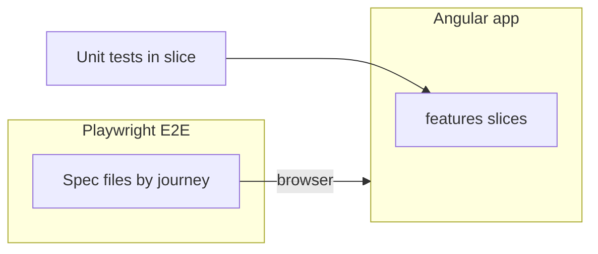

# WheelchairTaxiPro – Wireframe & Build Specification

> **See also:** [`frontend/ARCHITECTURE.md`](../frontend/ARCHITECTURE.md) — canonical folder layout, filename conventions, and "what goes where" rules that apply the principles in this document.

## 1. Overview
This document describes the wireframe, system design, and architectural approach for the WheelchairTaxiPro application.

The system connects wheelchair users with accessible taxis via a map-based interface, supporting Hong Kong and future China deployment.

---

## 2. Architectural Approach (UPDATED)

### 2.1 Why Vertical Slice Architecture

The frontend will adopt a **Vertical Slice Architecture** approach, organizing the application by **features instead of technical layers**.

This aligns well with the nature of the system:
- Feature-driven (search, map, taxi list, communication)
- Iterative MVP development
- Clear separation of user journeys

---

### 2.2 What is a Vertical Slice (Frontend Context)

A vertical slice represents a **complete feature**, including:

- UI components
- State management
- Services / logic
- Models
- **Tests (unit / component)** — colocated as `*.spec.ts` in the slice (see §2.9)

End-to-end tests are **not** duplicated per slice folder; they live in a shared **`e2e/`** tree and exercise journeys that may cross several slices (see §2.10).

Each slice is **independent and self-contained** for feature code and unit tests.

---

### 2.3 Example Feature Slices for This App

```text
src/app/features/
  trip-planning/
  map-view/
  taxi-discovery/
  fare-estimation/
  communication/
  map-provider-settings/
```

Each slice contains everything required for that feature.

---

### 2.4 Example Slice Structure

```text
features/map-view/
  map.component.ts
  map.service.ts
  map.facade.ts
  map.models.ts
  map.utils.ts
  map.component.html
  map.component.scss
  map.component.spec.ts
  README.md

// E2E: specs live outside the slice — e.g. ../../e2e/map-view.spec.ts (see §2.10)
```

---

### 2.5 Benefits for This Project

- Faster feature development
- Easier onboarding (one folder = one feature)
- Reduced coupling between features
- Better alignment with Agile development
- Easier to evolve MVP → production

---

### 2.6 Hybrid Approach (Recommended)

To avoid duplication and manage cross-cutting concerns, a **hybrid architecture** will be used.

#### Shared Layers

```text
src/app/core/
  services/
  config/
  guards/
  interceptors/

src/app/shared/
  ui-components/
  utils/
  models/
```

---

### 2.7 What Goes Where

| Type | Location |
|------|--------|
| Feature UI | features/* |
| Feature state/logic | features/* |
| API clients | core/services |
| Global config | core/config |
| Reusable UI | shared/ui-components |
| Utilities | shared/utils |
| E2E tests (Playwright) | `e2e/` at frontend (or monorepo) root (see §2.10) |

---

### 2.8 Key Principle

> Prefer feature isolation over premature abstraction.

- Avoid over-sharing logic too early
- Duplicate small logic if needed
- Extract only when patterns are stable

---

### 2.9 Testing strategy (unit + E2E)

- **Unit and component tests** stay **inside** each feature slice (`*.spec.ts` alongside components/services), using the Angular test stack (e.g. Jasmine/Karma or Jest, per project choice). They validate logic and UI in isolation with mocks.
- **End-to-end (E2E) tests** use **Playwright** (`@playwright/test`, TypeScript) to drive a real browser against the running app. They validate **user journeys** and regression across slices; they **complement** unit tests and do **not** replace them.

---

### 2.10 Playwright end-to-end tests

**Tooling:** `@playwright/test` as the runner. Install at **frontend app root** once the Angular workspace exists (or monorepo root if the repo holds both apps—pick one standard and keep `playwright.config.ts` next to that choice).

**Layout (aligned with slices / §3):** a dedicated folder such as `e2e/` (or `tests/e2e/`) at the chosen root, containing `playwright.config.ts` and spec files grouped by **journey** or **feature**, for example:

```text
e2e/
  playwright.config.ts
  trip-planning.spec.ts
  map-view.spec.ts
  taxi-discovery.spec.ts
  fare-estimation.spec.ts
  communication.spec.ts
```

**Selectors:** prefer stable **`data-testid`** (or accessible roles from Playwright) on primary controls so tests survive layout/CSS refactors.

**Wireframe → example E2E scenarios (smoke-level):**

| Slice (§3) | Example Playwright focus |
|------------|---------------------------|
| Trip planning | From/To inputs visible; location selection can be exercised; submit/navigation where applicable |
| Map view | Map container present; user/route views; toggle (user center / route center) changes state or view |
| Taxi discovery | List or marker region present; optional API **mocking** for deterministic counts later |
| Fare estimation | Estimate flow reachable; result or error state assertable |
| Communication | `tel:` / WhatsApp / WeChat links `href` or buttons present and correct where testable without live sends |

**Environments and CI:** set `baseURL` from environment variables (local `ng serve` URL, or **Cloudflare Pages preview** URL for PR pipelines). In CI: build the app, serve static output or hit preview, then `npx playwright test`; on Linux agents use `npx playwright install --with-deps` as needed. Optionally enable **trace** or **screenshot on failure** for debugging.

**Scope:** E2E runs against **deployed or preview** frontend; the **backend** may be **staging**, **local API**, or **mocked** (HTTP interception) for MVP—document the chosen mode per environment. For **multi-map providers** (§4), provider-specific E2E may require **feature flags**, **fixed test provider**, or **test doubles** so maps and network calls stay **deterministic**.

**Accessibility (follow-up):** for an accessibility-oriented product, consider later adding **`@axe-core/playwright`** or Playwright accessibility assertions on critical screens—not required for initial MVP smoke E2E.

**How E2E relates to slices (diagram):**



---

## 3. Core Features (Wireframe Mapping)

### 3.1 Trip Planning Slice
- From / To input
- Location selection

### 3.2 Map View Slice
- User location display
- Route display
- Toggle (user center / route center)

### 3.3 Taxi Discovery Slice
- Show nearby taxis
- Taxi markers

### 3.4 Fare Estimation Slice
- Price calculation

### 3.5 Communication Slice
- Call
- WhatsApp
- WeChat

---

## 4. Multi-Map Provider Support

- Tencent Maps
- Amap
- Baidu
- Huawei

Use adapter pattern.

---

## 5. China / Hong Kong Compatibility

- Angular is safe to use
- Avoid Google services in China

---

## 6. Cloudflare Pages & PWA

- Angular PWA supported
- Deploy frontend to Cloudflare Pages

---

## 7. Deployment Strategy

- Cloudflare Pages (frontend)
- .NET backend
- Multi-environment support

---

## 8. Summary

The system uses:

- Angular (latest)
- Vertical Slice Architecture (frontend)
- Hybrid shared-core approach
- Multi-map provider support
- Cloudflare Pages + PWA
- Playwright E2E for critical user journeys (see §2.10)

---

## 9. Next Steps

1. Create feature folder structure
2. Build first slice (map-view)
3. Implement adapter pattern
4. Add PWA support
5. Add Playwright (`e2e/`, `playwright.config.ts`), first smoke specs for map-view + trip-planning, wire `baseURL` and CI
6. Deploy MVP

