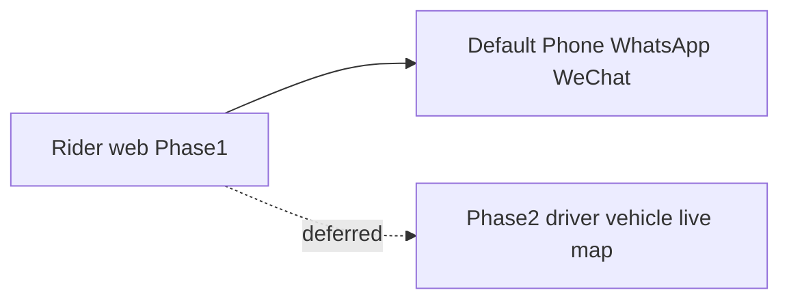

# WheelchairTaxiPro – Frontend Phase 1 Specification

This document defines **Phase 1** of the public **rider-facing** frontend: an Angular, mobile-first website (PWA-capable) without driver apps, fleet tracking, or live vehicles on the map.

---

## Vertical slice architecture (Phase 1)

Phase 1 uses the same **vertical slice** idea as the full frontend spec: organise by **feature** under `frontend/src/app/features/` (kebab-case folders), with **colocated** components, services, state, models, and `*.spec.ts` per slice. Keep cross-cutting pieces in **`core/`** (singletons, config, HTTP setup, guards) and **`shared/`** (reusable UI, utils)—see [13-Frontend-wheelchair_taxi_pro_wireframe_build_specification_updated_with_vertical_slice.md](13-Frontend-wheelchair_taxi_pro_wireframe_build_specification_updated_with_vertical_slice.md) §2.6–2.7.

**Example Phase 1 feature folders** (indicative—adjust names to match routes):

```text
frontend/src/app/features/
  booking/              # basic booking / pickup request (proposal §3.4)
  contact-strip/        # bottom Phone / WhatsApp / WeChat bar (or fold into shell/ if preferred)
  home/                 # landing / marketing entry
  faq/                  # FAQ content slice (supports §3.6 GEO/AEO copy)
```

Use **lazy-loaded routes** per feature where it keeps the initial bundle small.

**Deferred to Phase 2** (do not need Phase 1 slices yet): e.g. `taxi-discovery/`, live fleet `map-view/`, `map-provider-settings/`, `communication/` tied to per-driver channels—those appear in the long-term slice list in the wireframe doc §2.3; add them when driver/vehicle and live map are in scope.

---

## Phase 1 vs Phase 2 boundaries

| | Phase 1 (this document) | Phase 2 (later) |
|---|-------------------------|-----------------|
| Audience | Riders / public website | + Drivers, fleet operations |
| Contact | **Default** business / dispatch contact only (Phone, WhatsApp, WeChat) | Optional per-driver or per-vehicle contact from live map |
| Map & vehicles | Google Maps (and SEO/geo) for **user** pickup, routing context, discoverability — **no** taxi markers, **no** moving fleet layer | Live positions, driver location reporting, map markers |
| Apps | Rider web (installable PWA) | Driver client (e.g. PWA or native) as needed |



---

## Phase 1 wireframe — primary contact (bottom)

**Layout:** A **persistent bottom strip** (or footer-fixed bar on mobile) with **three** primary actions only:

1. **Phone** — `tel:` URI to the **default** dispatch / business number (config or environment-driven).
2. **WhatsApp** — link to `https://wa.me/...` (or equivalent) for the **same** default contact, not a specific driver.
3. **WeChat** — business WeChat link, QR landing page, or official account link as you standardize; still **one** default identity.

**Rules:**

- No dependency on driver identity, vehicle ID, or real-time fleet data.
- **Accessibility:** visible labels (EN + 中文 where applicable), sufficient touch targets, logical focus order; icons paired with text where possible.
- **Anti-fraud / analytics (see proposal §3.5 below):** contact CTAs are prime candidates for **click frequency limiting**, **IP or session logging** (per privacy policy), and **Google Ads conversion** tags if used.

---

## 3. Key Features | 核心功能

### 3.1 One-Click Contact | 一鍵聯絡

**EN**: Users can instantly contact drivers via Phone, WhatsApp, LINE, or WeChat.  
**中文**：用戶可一鍵透過電話、WhatsApp、LINE 或 WeChat 聯絡司機。

### 3.2 Location Detection | 定位功能

**EN**: Automatically detect user location to simplify booking.  
**中文**：自動獲取用戶位置，方便填寫接送地點。

### 3.3 Installable Web App (PWA) | 可安裝應用（PWA）

**EN**: Users can install the website as an app on mobile and desktop.  
**中文**：用戶可將網站安裝到手機或電腦，像應用程式一樣使用。

### 3.4 Basic Booking System | 基本預約系統

**EN**: Users can submit booking requests with pickup details.  
**中文**：用戶可提交預約請求及接送資料。

### 3.5 Anti-Fraud Protection | 防止惡意點擊

**EN**:

- IP tracking
- Click frequency limiting
- Google Ads conversion tracking

**中文**：

- IP 記錄
- 點擊頻率限制
- Google 廣告轉換追蹤

### 3.6 Google Maps, AI search visibility & GEO / AEO | Google 地圖、AI 搜尋顯示及 GEO／AEO

**EN**:

- Google Business Profile setup
- Structured data (Schema.org) for SEO
- Location-based content optimisation
- Integration with Google Maps

**GEO / AEO (AI search and answer engines)**  
- **GEO** (*Generative Engine Optimization*): improving how likely your **accurate, trustworthy** information is to be **retrieved and cited** when users ask **generative AI** or **AI-augmented search** (e.g. overviews, chat-style answers).  
- **AEO** (*Answer Engine Optimization*): shaping pages so **answer-style systems** can extract **clear, factual snippets** (who you are, what you offer, areas served, how to book, pricing themes, FAQs).  
- **Practical overlap with this project**: strong **FAQ** and **service** copy (Chinese + English), consistent **business facts** (name, phone, WhatsApp, service area), **Schema.org** (`LocalBusiness`, `FAQPage`, `Service`, etc.), and **internal linking**—the same building blocks support **SEO**, **Google Maps / Business Profile**, and **GEO / AEO**.

This ensures the business can appear in Google Maps and AI-powered search results (AI Mode), and strengthens discoverability as users increasingly use **AI-assisted** ways to find services like wheelchair taxis in Hong Kong.

**中文**：

- 建立 Google 商家資料（Google Business Profile）
- 使用結構化數據（Schema.org）提升 SEO
- 地區性內容優化
- 整合 Google 地圖

**GEO／AEO（AI 搜尋與答案引擎）**  
- **GEO**（**生成式引擎優化**，*Generative Engine Optimization*）：當用戶使用**生成式 AI**或**AI 增強搜尋**（例如摘要、對話式回答）時，提高**正確、可信**資訊被**檢索與引用**的機會。  
- **AEO**（**答案引擎優化**，*Answer Engine Optimization*）：調整頁面結構，使**答案型系統**易於擷取**清晰、事實性**片段（誰是誰、服務內容、服務範圍、如何預約、收費要點、常見問題等）。  
- **與本項目之實務重疊**：紮實的 **FAQ** 與**服務**文案（中／英）、一致的**商家資訊**（名稱、電話、WhatsApp、服務區域）、**Schema.org**（如 `LocalBusiness`、`FAQPage`、`Service` 等）及**內部連結**—同一套基礎同時支撐 **SEO**、**Google 地圖／商家檔案**及 **GEO／AEO**。

確保網站可出現在 Google 地圖及 AI 搜尋結果（AI Mode），並在港人用**AI 輔助**方式尋找輪椅的士等服務時，提升可發現性。

### 3.7 Bilingual experience (Hong Kong Chinese & English) | 雙語體驗（香港中文與英文）

**EN**

- The website will be available in **Traditional Chinese (Hong Kong)** and **English**, covering all main customer-facing pages (navigation, services, pricing, booking, FAQ, contact, etc.).
- A **clear, persistent language switch** (e.g. **中文 | EN** or a toggle in the header) lets users change language at any time; the choice can be **remembered** for return visits (e.g. browser storage), subject to your privacy policy.
- **Default language on first visit** will be determined **from the user’s location / locale**, for example:
  - **Browser language** (`Accept-Language` / device settings), and/or
  - **Approximate region** derived from IP or similar signals (with sensible fallbacks), so visitors in or near **Hong Kong** are more likely to see **Traditional Chinese** first, while other regions default to **English** unless the browser indicates Chinese.
- Users who deny location for booking maps are **not** blocked from using the site; language default then follows **browser language** (and the language switch remains available).

**中文**

- 網站將同時提供**香港繁體中文**及**英文**，涵蓋主要對客頁面（導覽、服務、收費、預約、常見問題、聯絡等）。
- 頁面上設有**明顯且持續可見的語言切換**（例如頂部 **中文 | EN** 或切換按鈕），用戶可隨時轉換語言；選擇可**記住**以便下次到訪（例如瀏覽器儲存），並須在私隱政策中說明。
- **首次到訪的預設語言**將依**用戶所在地區／語言環境**決定，例如：
  - **瀏覽器語言**（`Accept-Language`／裝置設定），及／或
  - 由 **IP 等訊號推算的大致地區**（並設合理後備邏輯），使身處或鄰近**香港**的訪客較大機會預設見**繁體中文**，其他地區則預設**英文**（除非瀏覽器標示中文）。
- 若用戶拒絕為地圖／定位授權，**不影響**瀏覽網站；語言預設改以**瀏覽器語言**為準，且**語言切換**仍可使用。

---

### Phase 1 scoping notes (how this phase narrows the proposal above)

- **§3.1**: Proposal includes **LINE**; **Phase 1 UI** implements **Phone + WhatsApp + WeChat** only, all for **one default** contact. LINE may be added in a later phase if product requires it.
- **§3.2 / §3.6**: Location and Google Maps apply to **rider** pickup / booking and **SEO / discoverability**. Phase 1 has **no** live fleet layer, **no** moving vehicles, **no** per-driver map pins.
- **§3.4**: Basic booking remains in scope (form + submit to backend or email/workflow as designed). Phase 1 does **not** require automated assignment to a specific driver; requests may be handled via **default contact channels** or **manual dispatch** until Phase 2.

*Source for §3.1–3.7: [6-wheelchair_taxi_website_platform_proposal_bilingual_v_2.md](6-wheelchair_taxi_website_platform_proposal_bilingual_v_2.md) §3.*
