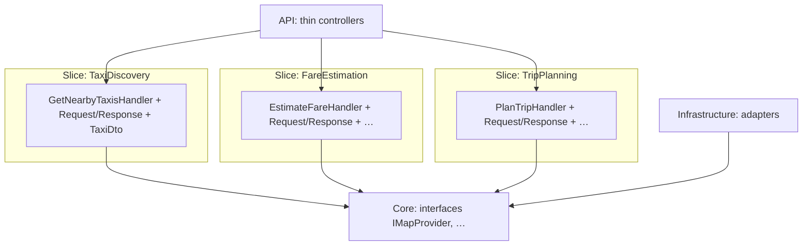
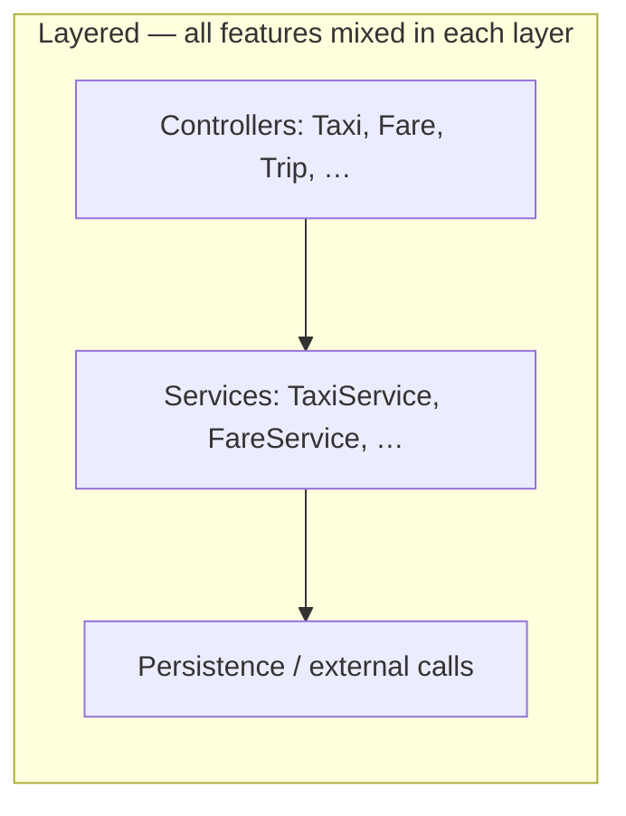
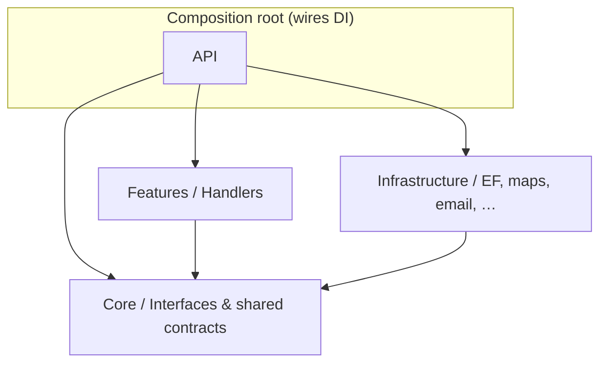
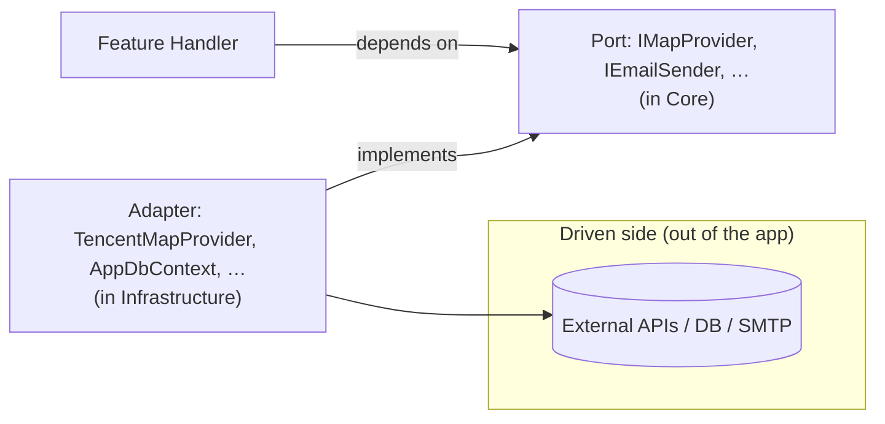
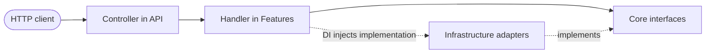
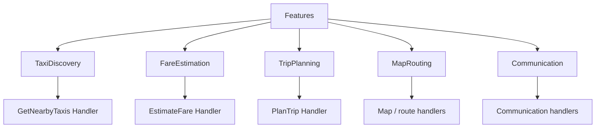
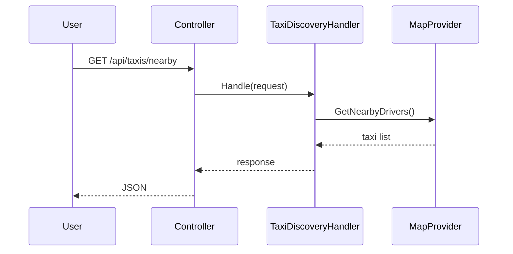

# WheelchairTaxiPro – Backend Architecture Plan (Phase 1: No MediatR)

> This document merges the **Phase 1 implementation plan** with the **detailed vertical-slice explanation** (formerly `wheelchair_taxi_pro_backend_plan_v_4_detailed_slice_explanation.md`). Use it as the single backend reference for MVP.

## 1. Overview

This version defines the **Phase 1 (MVP) backend architecture** without using MediatR or any paid libraries.

**Goals**

- Keep the system **simple**
- Deliver features **fast**
- Avoid unnecessary abstraction

The sections below first explain **what a vertical slice is and how to think in folders**, then give **concrete structure, code samples, and evolution** (including when *not* to add a mediator).

---

## 2. Core principle

> Use **Vertical Slice Architecture** with **simple handlers** (no mediator).

**Flow**

```
Controller → Handler → Service → External API / Database
```

---

## 3. What is a feature slice? (simple explanation)

A **feature slice = one complete business feature**.

Examples:

- “Find nearby taxis” → one slice (**TaxiDiscovery**)
- “Calculate fare” → one slice (**FareEstimation**)
- “Plan trip” → one slice (**TripPlanning**)
- “Map / routing” → one slice (**MapRouting**)
- “Notify / messaging hooks” → one slice (**Communication**)

Each slice contains **everything needed for that feature** (request/handler/response + feature models), instead of spreading one feature across many horizontal `Services/` layers.

### 3.1 Diagram — vertical slice architecture (concept)

**Idea:** organise by **feature** (a vertical “slice” through the app), not by **technical layer** alone. Controllers in **`API/`** stay thin and call the handler for that feature; the handler lives with its **request/response/types** under **`Features/<Slice>/`**. **Shared** contracts sit in **`Core/`**; **implementations** in **`Infrastructure/`**.

#### Slices side-by-side (each column is one feature)



#### Contrast: layered (anti-pattern for primary structure)



This plan **does not** use that as the main layout; it uses **`Features/<Name>/...`** so one business capability stays **co-located** (see §10).

---

## 4. Where are the feature slices?

They live under:

```
src/Features/
```

Each **top-level folder** under `Features/` is one slice.

---

## 5. Project structure (canonical for this plan)

```
/src
  /Features
    /TaxiDiscovery
    /TripPlanning
    /MapRouting
    /FareEstimation
    /Communication

  /Core
    /Interfaces

  /Infrastructure
    /ExternalServices
    /Persistence

  /API
```

**Example tree (one slice expanded)**

```
src/
  Features/
    TaxiDiscovery/
      GetNearbyTaxis/
        GetNearbyTaxisRequest.cs
        GetNearbyTaxisHandler.cs
        GetNearbyTaxisResponse.cs
      Models/
        TaxiDto.cs

    FareEstimation/
      EstimateFare/
        EstimateFareRequest.cs
        EstimateFareHandler.cs
        EstimateFareResponse.cs

    TripPlanning/
      PlanTrip/
        PlanTripRequest.cs
        PlanTripHandler.cs
        PlanTripResponse.cs

  Infrastructure/
  Core/
  API/
```

### 5.1 What belongs in `API/`, `Core/`, and `Infrastructure/`?

These three areas are **shared** by all features. **Feature-specific** behaviour, DTOs, and handlers stay under **`Features/`** unless you deliberately promote something to shared code (see earlier DTO guidance).

#### `API/` — web host and HTTP entry points

| Put here | Examples (Wheelchair Taxi Pro) |
|----------|--------------------------------|
| ASP.NET Core bootstrap | `Program.cs`, `appsettings.json`, environment config |
| Controllers (or minimal APIs) | Thin `TaxiController`, `BookingsController` — parse HTTP, call a **handler** from `Features/`, return status codes |
| Cross-cutting HTTP concerns | Global exception handler, **CORS**, **forwarded headers** (if behind Cloudflare), request logging |
| API documentation | Swagger / OpenAPI (Development) |
| Composition root (often) | Extension methods like `AddApplication()`, `AddInfrastructure()` that wire **DI** for handlers + infrastructure |

**Do not put here:** business rules, EF `DbContext`, map API client code, or feature DTOs (except as returned types from controllers — the DTO **types** usually live under the feature’s `Models/`).

---

#### `Core/` — shared contracts and (sparingly) shared domain

| Put here | Examples |
|----------|----------|
| **Interfaces** used by **multiple** feature handlers | `IMapProvider`, `IEmailSender`, `IBookingRepository` (if several slices persist bookings) |
| True **shared** primitives | Shared enums, constants, small value types **only** when more than one slice needs the same definition |
| Optional: **domain entities** | If you use a single persistence model shared across slices (e.g. `Booking` entity) — some teams keep entities here; others keep them next to the slice that owns the aggregate |

**Keep `Core/` thin.** Feature-scoped **DTOs** (`TaxiDto`, fare quote response shapes) stay under **`Features/<Slice>/Models/`** until real reuse forces a move.

**Do not put here:** HTTP types, controller attributes, concrete `HttpClient` code, EF configurations, or MediatR types (this plan uses **no MediatR**).

---

#### `Infrastructure/` — implementations of external and technical concerns

| Put here | Examples |
|----------|----------|
| **Persistence** | `AppDbContext`, EF Core entity configurations, migrations folder, concrete `BookingRepository` if you implement `IBookingRepository` |
| **External services** | `TencentMapProvider`, `AmapMapProvider`, `GoogleMapsProvider` (implementations of `IMapProvider`), **Turnstile** server-side verify client, **SendGrid** / SMTP mailer |
| **Cross-cutting tech** | Clock abstraction implementation, distributed cache wrapper (if added later), file/blob storage client |

**Do not put here:** feature **handlers** (they belong in `Features/`), **controllers**, or UI/API-specific models.

---

**Dependency direction (typical):**

```
API  →  Features (handlers)  →  Core (interfaces)  ←  Infrastructure (implementations)
```

Handlers in `Features/` depend on **abstractions** from `Core/`; `Infrastructure/` provides **concrete** types registered in DI at startup in `API`/`Program.cs`.

**Rules (Clean / Hex friendly):**

- **`Core`** does **not** reference `Features`, `Infrastructure`, or `API`.
- **`Features`** reference **`Core`** (handlers take `IMapProvider`, etc.).
- **`Infrastructure`** references **`Core`** (classes implement interfaces defined there).
- **`API`** references **`Features`** and **`Infrastructure`** (and usually **`Core`**) so it can register everything in DI and expose HTTP.

Below, an arrow **A --> B** means **“A depends on / references B”** (same idea as C# project references when you split assemblies; if everything is one project, read this as **logical** layers).

#### Diagram 1 — module reference direction



#### Diagram 2 — handler uses port, adapter implements port (Hex view)



#### Diagram 3 — request path (runtime, not compile-time)



At **runtime**, the handler receives a concrete `IMapProvider` resolved from DI; **compile-time** references still follow Diagram 1 so **`Core`** stays free of infrastructure details.

**Example layout (illustrative — names may vary):**

```
API/
  Program.cs
  appsettings.json
  Controllers/
    TaxiController.cs
    BookingsController.cs
  Middleware/           (optional)
  Extensions/           (optional DI registration)

Core/
  Interfaces/
    IMapProvider.cs
    IEmailSender.cs
    IBookingRepository.cs   (if shared)

Infrastructure/
  Persistence/
    AppDbContext.cs
    Configurations/         (optional EF configs)
    Migrations/
  ExternalServices/
    TencentMapProvider.cs
    AmapMapProvider.cs
    TurnstileService.cs
    SmtpEmailSender.cs
```

---

## 6. Visual: slices under `Features`



---

## 7. What is inside a slice?

Example: **TaxiDiscovery**

```
TaxiDiscovery/
  GetNearbyTaxis/
    GetNearbyTaxisRequest.cs   ← input
    GetNearbyTaxisHandler.cs   ← logic
    GetNearbyTaxisResponse.cs  ← output
  Models/
    TaxiDto.cs
```

---

## 8. How a slice works (step-by-step)



---

## 9. Key rules

Each slice should be:

- **Independent**
- **Self-contained**
- **Not tightly coupled** to other slices

**Mental model**

- ❌ “I am writing a service”
- ✅ “I am building the **TaxiDiscovery** feature”

---

## 10. What should *not* happen

❌ Do **not** organise only by technical layer like this as the primary structure:

```
Services/
  TaxiService.cs
  FareService.cs
  TripService.cs
```

That is **layer-based**, not **vertical slice**. Prefer `Features/<FeatureName>/...` as above.

---

## 11. Why vertical slices are useful

- Easy to understand (**one feature ≈ one folder**)
- Easier to change with **fewer side effects**
- Easier to scale the team (**parallel work per slice**)

---

## 12. Mapping to the frontend (indicative)

| Frontend area   | Backend slice      |
|-----------------|--------------------|
| map-view        | MapRouting         |
| taxi-discovery  | TaxiDiscovery      |
| trip-planning   | TripPlanning       |
| fare-estimation | FareEstimation     |
| notifications / comms | Communication |

---

## 13. Example feature slice (TaxiDiscovery) – recap

```
Features/TaxiDiscovery/
  GetNearbyTaxis/
    GetNearbyTaxisRequest.cs
    GetNearbyTaxisHandler.cs
    GetNearbyTaxisResponse.cs
  Models/
    TaxiDto.cs
```

---

## 14. Example implementation

### Controller

```csharp
[ApiController]
[Route("api/taxis")]
public class TaxiController : ControllerBase
{
    private readonly GetNearbyTaxisHandler _handler;

    public TaxiController(GetNearbyTaxisHandler handler)
    {
        _handler = handler;
    }

    [HttpGet("nearby")]
    public async Task<IActionResult> GetNearby([FromQuery] GetNearbyTaxisRequest request)
    {
        var result = await _handler.Handle(request);
        return Ok(result);
    }
}
```

### Handler

```csharp
public class GetNearbyTaxisHandler
{
    private readonly IMapProvider _mapProvider;

    public GetNearbyTaxisHandler(IMapProvider mapProvider)
    {
        _mapProvider = mapProvider;
    }

    public async Task<List<TaxiDto>> Handle(GetNearbyTaxisRequest request)
    {
        return await _mapProvider.GetNearbyDrivers(
            request.Latitude,
            request.Longitude
        );
    }
}
```

---

## 15. Map provider abstraction

```
IMapProvider
  GetNearbyDrivers()
  GetRoute()
```

**Implementations (examples)**

- TencentMapProvider  
- AmapProvider  
- BaiduProvider  

---

## 16. Why this approach (no MediatR in Phase 1)

### Advantages

- Very easy to understand  
- No hidden framework behaviour  
- No extra licensing for a mediator package  
- Fast to build MVP  
- Easy debugging  

---

## 17. Phase 2 (optional – custom mediator)

### When to consider it?

Only if you start seeing:

- Repeated logging logic  
- Repeated validation logic  
- Need for consistent pipelines  
- Many handlers with duplicated patterns  

### Is it worth it for this project now?

👉 **Not worth it at early stage**

- Small number of features  
- Speed over abstraction  
- Extra layer adds complexity without clear benefit  

### When it becomes worth it

✔ **20+** features, multiple developers, complex workflows, cross-cutting concerns everywhere  

---

## 18. Evolution strategy

1. **Start simple** (this document)  
2. Add **shared utilities** only when duplication is real (see `DiscussArchitectures.md` – avoid “god” helpers)  
3. Introduce a **mediator** only if pain appears  

---

## 19. Final recommendation

**Phase 1**

- Vertical slice  
- Simple handlers  
- No MediatR  
- No custom mediator  

**Phase 2 (only if needed)**

- Introduce custom mediator **carefully**  

---

## 20. Next steps

1. Create .NET project  
2. Implement **TaxiDiscovery** slice  
3. Connect to map API  
4. Return real data  

---

## 21. Summary (vertical slice recap)

- Slices live under **`Features/`**  
- Each top-level folder = **one feature**  
- Each feature owns its **request / handler / response** (and feature models)  
- **Phase 1** stays explicit: **Controller → Handler → …** with **no MediatR**  

---

*END*
