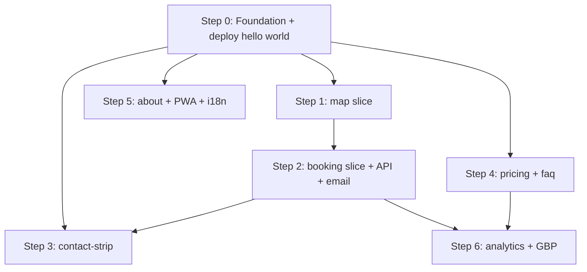

# Phase 1 Build Order

> **Purpose:** A step-by-step implementation sequence for the Phase 1 MVP. Answers the question *"which slice do we build first, and why?"*.
>
> **Audience:** Developers picking up the repo for the first time.
>
> **See also:**
> - [`1-project-plan.md`](1-project-plan.md) — overall SEO & website group strategy
> - [`7-wheelchair_taxi_project_task_breakdown_implementation_guide.md`](7-wheelchair_taxi_project_task_breakdown_implementation_guide.md) — per-task breakdown
> - [`13-1-Frontend-phase1.md`](13-1-Frontend-phase1.md) — Phase 1 frontend scope
> - [`13-3-wireframe-phase1.jpeg`](13-3-wireframe-phase1.jpeg) — Phase 1 wireframe (source of truth for UI)
> - [`14-Backend-wheelchair_taxi_pro_backend_plan_v_2_no_mediat_r.md`](14-Backend-wheelchair_taxi_pro_backend_plan_v_2_no_mediat_r.md) — backend vertical-slice layout
> - [`../frontend/ARCHITECTURE.md`](../frontend/ARCHITECTURE.md) — canonical frontend folder layout
> - [`../docs/hosting-an-seo-first-angular-pwa-on-cloudflare-pages.md`](../docs/hosting-an-seo-first-angular-pwa-on-cloudflare-pages.md) — hosting rationale

---

## TL;DR

**Build a thin vertical slice through the whole stack before building any slice in depth.** Specifically:

1. **Scaffold + deploy "hello world"** (both FE and API, to production) — 1 day
2. **`map/` slice** (minimum functionality that feeds booking) — 2–3 days
3. **`booking/` slice + .NET `Booking` handler + email** (end-to-end real booking) — 2–3 days
4. **`contact-strip/`** — ½ day
5. **`pricing/` + `faq/`** (SEO workhorses) — 2–3 days
6. **`about/` + PWA polish + bilingual switcher** — 1–2 days
7. **Analytics + Google Business Profile** — ½ day

**Total: ~3–4 weeks to an SEO-viable, bookable, installable MVP.**

The map comes before booking because **map is the booking form's primary input surface** — pickup and drop-off are selected by tapping the map, not typed as free text. Text-only address entry is not a usable experience for the HK market.

---

## Guiding principles

1. **End-to-end before in-depth.** The first week should produce something a rider can actually use, even if rough. This proves the architecture (FE ↔ API ↔ email) and catches integration bugs while the codebase is still small.
2. **Respect dependencies revealed by the wireframe.** The wireframe is the source of truth for the UI. Where two slices share state (map → booking), build the producer first and define the shared contract up front.
3. **SEO runs in parallel, not sequentially.** Google takes ~90 days to show SEO effects anyway, so losing 7–10 days between deploy-day and pricing/FAQ content doesn't measurably hurt ranking. Don't let SEO content block the transactional loop.
4. **Keep Phase 1 scope boringly tight.** No live fleet, no driver apps, no payments, no per-driver contact. Those belong in Phase 2 and trying to pre-build them now will bloat the slices you're shipping.

---

## Step 0 — Foundation + deploy "hello world"

**Goal:** Scaffolded projects running locally and both deployed to production infrastructure before any real code is written.

**Why first:** Deployment issues are cheap to fix when the app is empty, expensive once five slices depend on a misconfigured CORS header or wrong build output path.

### Tasks

- [ ] `ng new frontend` — Angular 21, standalone APIs, SCSS, SSR prompt → **yes**
- [ ] `ng add @angular/ssr` — set `"prerender": true` in `angular.json` build target
- [ ] `dotnet new webapi -n WheelchairTaxi.API` into `backend/src/API/`
- [ ] Create empty folders `backend/src/Core/Interfaces/`, `backend/src/Features/`, `backend/src/Infrastructure/ExternalServices/`, `backend/src/Infrastructure/Persistence/` per [`14-Backend-…_no_mediat_r.md`](14-Backend-wheelchair_taxi_pro_backend_plan_v_2_no_mediat_r.md) §5
- [ ] Add `GET /api/health` returning `{ status: "ok" }`
- [ ] Configure CORS on the API to allow the FE origins (local + `*.pages.dev` + production domain)
- [ ] Angular `HomeComponent` fetches `/api/health` and displays the response (proves end-to-end wiring)
- [ ] Set up Git remotes; commit both scaffolds
- [ ] **Deploy FE to Cloudflare Pages** — framework preset Angular, build `ng build`, output `dist/<app>/browser`, `NODE_VERSION=22`
- [ ] **Deploy API to Railway or Fly.io** — Hong Kong or Singapore region, environment variables for `Cors:AllowedOrigins` and (placeholder) SMTP settings
- [ ] Point `wheelchairtaxipro.com` at Pages, `api.wheelchairtaxipro.com` at the API via Cloudflare DNS
- [ ] Verify from a mobile browser that the Angular shell loads and successfully reaches `api.wheelchairtaxipro.com/api/health`

### Done when

✅ A phone on mobile data can hit `https://wheelchairtaxipro.com` and see live data fetched from `https://api.wheelchairtaxipro.com/api/health`. **Nothing more.**

### Prerequisites to have in hand *before* starting Step 0

- [ ] Cloudflare account with access to the target domain
- [ ] Railway / Fly.io / Render account
- [ ] GitHub (or GitLab) remote for the repo

---

## Step 1 — `map/` slice (minimum that feeds booking)

**Goal:** The map tab lets a user select pickup + drop-off and hand that selection to the booking form.

**Why second:** Pickup and drop-off are the two hardest booking inputs. HK addresses are long and mixed-language; typing them on mobile is error-prone and unprofessional. A map-based picker is the standard HK UX (every competitor has one).

### Scope (exactly these five capabilities — nothing more)

1. Load Google Maps JS SDK
2. Request browser geolocation → center map on user's current position (with graceful fallback if denied)
3. Tap on map → drop **pickup pin**, reverse-geocode to a human address string
4. Tap again → drop **drop-off pin**, reverse-geocode, draw route via Directions API
5. Show distance + rough fare estimate (static formula in Phase 1: base + per-km from `13-4-…_pricing_content`)

### Out of scope for Phase 1

❌ Live fleet markers · ❌ driver pins · ❌ per-driver contact · ❌ real-time traffic overlay · ❌ multi-stop planning

### Shared contract (define up front, in `shared/`)

```ts
// src/app/shared/models/trip.models.ts
export interface GeoPoint {
  lat: number;
  lng: number;
  address: string;   // reverse-geocoded human-readable string
}

export interface TripSelection {
  pickup:  GeoPoint;
  dropoff: GeoPoint;
  distanceKm: number;
  estimatedFareHkd: number;
}
```

```ts
// src/app/shared/services/trip-state.service.ts
import { Injectable, signal, computed } from '@angular/core';
import { TripSelection } from '../models/trip.models';

@Injectable({ providedIn: 'root' })
export class TripStateService {
  private readonly _selection = signal<TripSelection | null>(null);

  /** Read-only signal — templates and consumers call `trip.selection()`. */
  readonly selection = this._selection.asReadonly();

  /** Convenience derived state. */
  readonly hasTrip = computed(() => this._selection() !== null);

  set(selection: TripSelection) { this._selection.set(selection); }
  clear()                        { this._selection.set(null); }
}
```

Both `map/` and `booking/` depend on `TripStateService`; neither imports the other. This is the vertical-slice discipline.

> **State management rule for this project:** signals first, RxJS only for genuine streams (HTTP, debounced input, websockets). See [`frontend/ARCHITECTURE.md` §4a](../frontend/ARCHITECTURE.md) for the full rule.

### Tasks

- [ ] Provision Google Cloud project, billing, and a Maps JavaScript API key (also enable Places API + Directions API on the same key)
- [ ] Restrict the key to `wheelchairtaxipro.com` and `*.pages.dev`
- [ ] Implement `TripSelection`, `TripStateService` in `shared/`
- [ ] `features/map/` slice:
  - [ ] `map.ts` component with Google Maps + geolocation
  - [ ] Tap-to-drop pins, reverse geocoding, route rendering
  - [ ] Static fare formula in `map.service.ts` (one config object with base + per-km)
  - [ ] `立即預約 · Book Now` button → navigates to `/booking` (state is already in `TripStateService`)
- [ ] Unit tests for the fare formula
- [ ] Playwright E2E smoke test (`e2e/map.spec.ts`) that the map container renders and the book-now button is disabled until both pins are dropped

### Done when

✅ A user on mobile can: open `/map` → allow location → tap pickup → tap destination → see a route and fare estimate → tap the Book button and arrive on `/booking` with their selection preserved.

### Prerequisite to order *now*, in parallel with Step 0

🔑 **Google Maps API key with billing enabled.** Allow a day for account setup, domain restriction, and testing.

---

## Step 2 — `booking/` slice + `Booking` backend slice + email

**Goal:** The user submits a real booking and the dispatcher receives a real email.

**Why third:** Map is already done, so booking is *almost trivial*. The user has already chosen pickup/drop-off/fare — the form only needs three more fields.

### Frontend tasks — `features/booking/`

- [ ] Pull `TripSelection` from `TripStateService` on component init
- [ ] If selection is `null`, show a "Please choose pickup and drop-off on the map first" state with a link to `/map`
- [ ] Display pickup / drop-off / fare as read-only summary
- [ ] Form fields: Date/Time, Phone (required), Email (required)
- [ ] Client-side validation (HK phone format, valid email, date not in past)
- [ ] `booking.service.ts` POSTs to `api.wheelchairtaxipro.com/api/bookings`
- [ ] Loading, success, and error UI states
- [ ] `e2e/booking.spec.ts` Playwright smoke test with API mocked

### Backend tasks — `backend/src/Features/Booking/SubmitBooking/`

Per `design/14-…_no_mediat_r.md`:

- [ ] `SubmitBookingRequest.cs` — DTO matching the FE payload
- [ ] `SubmitBookingHandler.cs` — validates, builds email content, calls `IEmailSender`
- [ ] `SubmitBookingResponse.cs` — `{ bookingReference, status }`
- [ ] `IEmailSender` in `Core/Interfaces/`
- [ ] `SmtpEmailSender` in `Infrastructure/ExternalServices/`
- [ ] `BookingsController` in `API/Controllers/` — thin, parses HTTP → calls handler
- [ ] Register handler + `SmtpEmailSender` in `Program.cs` DI
- [ ] ASP.NET rate limiter on `POST /api/bookings` (e.g. 5/min per IP) — design doc §3.5 anti-fraud
- [ ] Unit test covering "handler builds the right email body"

### Email content (Phase 1)

- To **dispatcher**: full booking details (pickup, drop-off, fare estimate, date/time, phone, email)
- To **rider**: confirmation with booking reference, service hotline, and pickup/drop-off summary
- Both bilingual (Traditional Chinese + English, Chinese first)

### Done when

✅ Fill the form on your phone → tap submit → within 10 seconds the dispatcher inbox receives a real, parseable email and the rider gets a confirmation.

**At this point the site is launchable as an MVP.** Every subsequent step is additive.

### Prerequisites

- [ ] SMTP credentials (SendGrid API key, or Google Workspace SMTP, or similar) — set as env vars on Railway/Render
- [ ] The **dispatcher's real email address**
- [ ] The **business phone number** to reference in the confirmation email
- [ ] Booking reference format agreed (e.g. `WCT-20260418-A1B2`)

---

## Step 3 — `contact-strip/`

**Goal:** Persistent bottom bar with Phone / WhatsApp / WeChat — the safety-net channel if JS fails, or for riders who prefer to talk to a human.

### Tasks

- [ ] `features/contact-strip/contact-strip.ts` component imported into root `App`
- [ ] Three buttons: `tel:+852XXXX`, `https://wa.me/852XXXX?text=…`, WeChat modal with QR + copyable ID
- [ ] GA4 event on each click
- [ ] Angular rate-limit pipe (client-side) to prevent accidental double-taps registering as two conversions
- [ ] Accessibility: visible EN + 中文 labels, 44×44 px touch targets, logical focus order

### Done when

✅ All three channels work on a real phone. Tapping Phone opens the dialer. Tapping WhatsApp opens WhatsApp with a pre-filled message. Tapping WeChat shows a QR modal the user can scan from a second device.

---

## Step 4 — `pricing/` + `faq/` (SEO workhorses)

**Goal:** The content pages that drive Google ranking for the target keywords.

**Why fourth:** By now you've been deployed for ~1–2 weeks, so Google has already discovered the site and is waiting for content. These pages convert that crawl attention into rankings.

### `features/pricing/`

- [ ] Fare table from `13-4-…_booking_form_pricing_content` — bilingual
- [ ] Tunnel fees breakdown
- [ ] Additional charges explanation
- [ ] Clear CTA → `/map` (start a booking)
- [ ] `FAQPage` Schema.org block for pricing-specific questions
- [ ] Unit test that pricing values match a single source-of-truth config (so pricing is never wrong between map estimate and pricing page)

### `features/faq/`

- [ ] 15–20 Q&As, bilingual — source content from `1-project-plan.md` §2.3 FAQ
- [ ] `FAQPage` JSON-LD
- [ ] Anchor links per question
- [ ] `e2e/faq.spec.ts` Playwright smoke test

### Done when

✅ Pricing + FAQ deployed, sitemap submitted to Google Search Console, structured-data validator returns zero errors.

---

## Step 5 — `about/` + PWA polish + bilingual switcher

### `features/about/`

- [ ] Company story, fleet info, driver qualifications, service area coverage
- [ ] `LocalBusiness` Schema.org JSON-LD
- [ ] Photos from the Google Business Profile asset library

### PWA polish

- [ ] `public/manifest.webmanifest` with full icon set (192, 512, maskable)
- [ ] Splash screens for iOS
- [ ] Service worker wired in `app.config.ts` via `provideServiceWorker()`
- [ ] Offline fallback for `/map` and `/pricing` (cached last successful response)
- [ ] Install prompt handler

### Bilingual switcher

- [ ] Language toggle in header (中文 | EN)
- [ ] Language default logic: `Accept-Language` → locale region heuristic → fallback to `zh-HK`
- [ ] Persist choice in `localStorage`
- [ ] English route tree under `/en/...`

### Done when

✅ Site installs cleanly on iOS and Android home screens. Language toggle works and persists. Offline pages render.

---

## Step 6 — Analytics + Google Business Profile

- [ ] GA4 property + Measurement ID wired via `core/services/analytics.service.ts`
- [ ] Conversion events: `booking_submitted`, `phone_click`, `whatsapp_click`, `wechat_click`
- [ ] Google Search Console verified (DNS or HTML file on Cloudflare Pages)
- [ ] Google Business Profile created, verified, fully populated per `1-project-plan.md` §4
- [ ] 20+ photos uploaded (vehicle exterior, interior, ramp, driver, airport pickup)

---

## Dependency graph (visual)



`S1 → S2` is the only strict dependency. `S3`, `S4`, `S5` can be built in parallel once foundation is ready, if you have multiple developers.

---

## Alternative sequences (and when to pick them)

### Alternative A — SEO-first
Flip Steps 2 and 4: ship `pricing/` + `faq/` + `about/` first as prerendered static pages with no backend, then add `map/` and `booking/`.

**Pick this if** competitors have years of domain authority and you need Google crawling you *yesterday*. Riders can still book via the contact strip in the meantime.

### Alternative B — Contact-strip-only launch
Skip `map/` and `booking/` entirely for week 1. Ship a one-page site with logo + 3 lines of copy + phone/WhatsApp/WeChat buttons.

**Pick this if** you want a Facebook link destination *this week* and you'll build the real site later.

### Default recommendation
**Stick to the main sequence above.** It respects the wireframe, proves the stack end-to-end early, and delivers a real bookable MVP in week 2–3 while leaving SEO content for weeks 3–4 — comfortably within Google's ~90-day ranking window.

---

## Exit criteria for Phase 1

Phase 1 is complete when **all** of the following are true:

- [ ] A rider on a mobile browser can select pickup + drop-off on the map, submit a booking, and receive a confirmation email
- [ ] Dispatcher receives a parseable booking email for every submission
- [ ] Site is installable as a PWA on iOS and Android
- [ ] Every public route is prerendered and returns real HTML to crawlers
- [ ] Traditional Chinese and English versions of every page exist
- [ ] `LocalBusiness`, `FAQPage`, and `Service` Schema.org JSON-LD validate without errors
- [ ] Google Search Console shows the sitemap as "Success" with pages indexed
- [ ] Google Business Profile is verified and fully populated
- [ ] GA4 tracks at least 7 days of traffic with `booking_submitted` conversions firing
- [ ] Core Web Vitals on the homepage are all "Good" on real-user mobile data

Once complete, move to Phase 2 (multi-driver, dispatch, payments, live tracking — `design/1-project-plan.md` §3 and `design/7-…_implementation_guide.md` §4).

---

*Document version: 1.0 · Created: April 2026*
