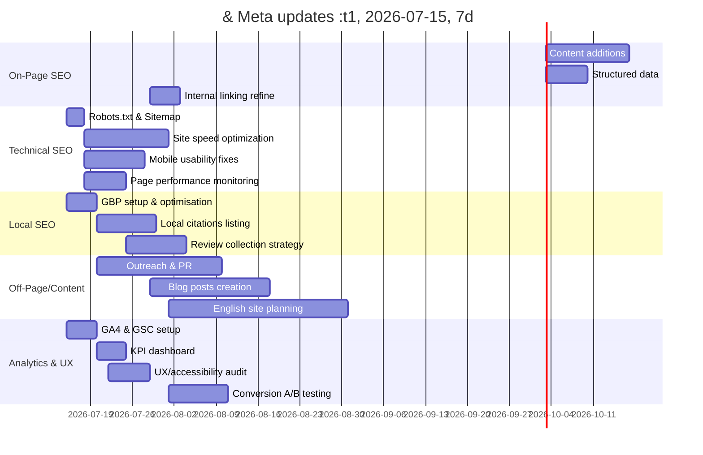

# Executive Summary  
**WheelchairTaxiPro.com** currently offers Hong Kong’s wheelchair-accessible taxi booking service with Traditional Chinese content. Our SEO audit identifies multiple actionable opportunities: ensuring complete crawlability/indexation, optimising on-page elements (title/meta/H1/content/keywords/internal links), improving technical performance (loading speed, mobile usability, HTTPS, structured data), strengthening local SEO signals (Google Business Profile, consistent NAP citations, reviews, localised content), expanding content (topic clusters, FAQs, possible English pages), enhancing UX/conversion (clear CTAs, booking flow, accessibility), and implementing analytics tracking (GA4, Search Console, rank tracking). We summarise findings and priorities below, with a detailed checklist, recommended tools/commands, current vs ideal metrics comparison, and a phased timeline for implementation.  

**Key Recommendations:** Update titles/meta with target keywords (e.g. “香港輪椅的士”), ensure unique H1s and rich content on all pages, add an XML sitemap and robots.txt, use JSON-LD LocalBusiness/TaxiService schema (complete with name, phone, address), improve page speed (aim LCP<2.5s, performance score ≥90), verify mobile-friendliness, set up/optimize Google Business Profile (complete NAP info, hours, categories), solicit reviews, build local citations, and track KPIs (organic traffic, rankings, conversions).  

We prioritise **technical fixes first** (indexation, sitemap, robots, HTTPS, speed optimisation) and **critical on-page fixes** (titles, descriptions, structured data), then **local and content growth** initiatives (GBP, citations, blog topics), and finally ongoing **analytics and UX testing**. Success will be measured via Search Console coverage, Core Web Vitals reports, GA4 conversion events, local ranking/reviews, and backlink audits.  

# Site Crawl, Indexation & Technical Audit  
- **Crawlability/Indexation:** No robots.txt or sitemap found. We recommend adding a `robots.txt` (allow all; point to sitemap) and an XML sitemap listing all site URLs (e.g. `/booking`, `/about`, `/pricing`, `/faq`, `/route`). Submit the sitemap in Google Search Console. Verify that Google indexes key pages (use `site:wheelchairtaxipro.com 輪椅的士` to spot-indexed pages). Ensure there are no unintended noindex tags.  
- **HTTPS & Domain:** Site uses HTTPS with valid certificate (good). Ensure all HTTP traffic 301-redirects to HTTPS. Check via `curl -I http://wheelchairtaxipro.com` (expect 301 to https). Consistency of URL (www vs non-www) should be enforced (choose one canonical).  
- **Canonicalisation:** Add `<link rel="canonical" href="https://wheelchairtaxipro.com/booking/" />` (etc) in head of each page to prevent duplicate content (e.g. `/page` vs `/page/`). Ensures Google indexes only the preferred URL.  
- **Page Speed:** Run Lighthouse or PageSpeed Insights (e.g. `npx lighthouse wheelchairtaxipro.com --only-categories=performance`). Current site likely heavy (JS-driven booking form). Aim for **Performance score ≥90 (green)**. Specifically, optimize Largest Contentful Paint (LCP) to under **2.5s** (ideal ~1.2s), minimize Total Blocking Time, and CLS <0.1. Use Chrome DevTools to identify render-blocking scripts, large images, and reduce JavaScript or CSS. Enable text/image compression (gzip/HTTP2), defer non-critical JS, and lazy-load offscreen images.  
- **Core Web Vitals:** Verify with Google Search Console’s Core Web Vitals report that LCP <2.5s, INP (or TTI) <200ms, CLS <0.1. If not meeting targets, improve server response time, optimize render path. Regularly monitor via Lighthouse or Web Vitals Chrome extension.  
- **Mobile Usability:** Test with Google’s Mobile-Friendly Test. All pages should be responsive (viewport meta, legible font sizes, buttons not too close). Ensure no mobile usability errors (touch elements appropriately sized, no Flash). Our layout appears mobile-friendly, but verify no content wider than viewport.  
- **Technical SEO Checklist:** 
  - Ensure **XML Sitemap** exists and submitted (e.g. `https://wheelchairtaxipro.com/sitemap.xml`).  
  - Add **robots.txt** (allow all; disallow none) pointing to sitemap.  
  - Use `<meta name="viewport" content="width=device-width, initial-scale=1.0">`.  
  - Check HTTP headers (via `curl -I`) for fast caching (cache-control) and gzip encoding.  
  - Set proper HTTP status codes (200 for content pages, 301/302 for redirects, 404 for missing pages).  
  - Implement structured data (see Local SEO below).  
  - Verify each page has one H1 and semantic heading structure (H2, H3), and images have descriptive alt text.  
- **Performance Benchmark Table (Current vs Recommended):**  

| Metric              | Current (approx)      | Recommended        | Notes / Source                             |
|---------------------|-----------------------|--------------------|--------------------------------------------|
| Page Titles         | ~12–20 chars (Chinese)| 50–60 chars         | e.g. “香港輪椅的士預約 – 輪的” (add keywords)   |
| Meta Descriptions   | Snippets present      | 50–160 chars       | Should be unique & keyword-rich           |
| H1 Tags             | Present (Chinese)     | 1 per page, relevant | Yes (e.g. “關於我們”)                  |
| Content Length      | Varies (~1,000–1,300 chars on about) | ≥300 words/page | Add text to *Booking* page (currently form-only) |
| HTTPS               | Yes                   | Yes                |                                            |
| Lighthouse Perf. Score | (unknown, likely <90) | ≥90 (green)       | LCP ≤2.5s                   |
| LCP (Largest Cont. Paint) | (unmeasured)        | <2.5s (ideal ~1.2s) | Improve image/script loading |
| Mobile Friendly     | Likely yes            | Yes (no issues)    |                                            |
| Structured Data     | None found           | Implement LocalBusiness/TaxiService schema | Use JSON-LD (see below)    |
| Robots.txt          | **Not found**         | Present, no disallows | Prevent accidental block    |
| XML Sitemap         | **Not found**         | Present and submitted | HTML sitemap page like `/route` not true sitemap |
| Google Indexing     | Pages found via Google | Full index        | Monitor in Search Console                    |

**Tools & Commands:** Use `curl` or `wget --spider` to check HTTP status (`curl -I`), Lighthouse CLI (`npx lighthouse`), PageSpeed Insights (web.dev or `psi` CLI), and Screaming Frog (crawl for broken links, missing meta). In Search Console, review Coverage and Mobile Usability reports. Use GTmetrix or WebPageTest for external speed data.

# On-Page SEO  
- **Title Tags:** Currently some pages have Chinese titles (e.g. “輪椅的士預約| 輪的· 香港”), which are short. We should lengthen and clarify titles to include key terms: e.g. “香港輪椅的士預約 – 輪的 交通服務”. Aim for ~50–60 characters, front-loaded with target keywords (“香港 輪椅的士 預約”) and end with brand name. Each page title must be unique. For example, About page: “關於我們 – 香港輪椅的士服務 | 輪的 輪椅的士”, Pricing: “香港輪椅的士收費 | 輪的 輪椅的士”. Use vertical bars or dashes to separate brand.  
- **Meta Descriptions:** Ensure each page has a unique `<meta name="description">` summarizing its content in Chinese (and English if applicable). Keep them informative (~50–150 chars), with keywords and a call-to-action. E.g. for booking: “即時預約香港輪椅的士及無障礙接送服務。填寫網上表格後以WhatsApp確認，提供九龍、新界及大嶼山服務。” (based on Search snippet). For FAQ, the snippet suggests “香港輪椅的士常見問題: 預約、收費、服務範圍、機場接送、車型等詳解”. Check lengths (aim ≤155 chars).  
- **H1 and Headings:** Each page has a clear H1 (e.g. “關於我們”, “收費 Pricing”, “常見問題”). That’s good. Ensure each page only one H1. Subheadings (H2/H3) should reflect keywords. E.g. FAQ questions as H3 with question text. Use heading tags semantically. This improves readability and SEO.  
- **Content Quality & Keywords:** Content is currently in Chinese, which is fine for HK. We should audit keyword usage: target terms include “輪椅的士” (wheelchair taxi), “香港 輪椅的士”, “無障礙 的士”, “輪椅接送 服務”, etc. Incorporate these naturally in headings and body text. Avoid keyword stuffing. On the booking page, add some descriptive text (even a short intro) so it’s not just a blank form. More valuable content (e.g. brief service description, reassurance on safety, instructions) can help SEO and UX.  
- **Internal Linking:** The site’s navigation links About/Pricing/FAQ, and footer links booking and routes. Ensure all major pages are linked from at least one other page. E.g. About page links to Pricing and Booking (already done with “查看收費詳情” and “立即預約”). The route page links too. Consider adding a brief link to FAQ from About (if relevant). The “立即預約” CTA should appear prominently (already is on About/FAQ footer). Use keyword-rich anchor text where possible (e.g. “輪椅的士收費” linking to Pricing page).  
- **Image Alt Text:** All images (e.g. logo) have alt attributes. Currently the logo alt is “輪椅的士標誌 Wheelchair taxi logo”. For SEO, alt text should describe the image content with keywords. For the logo, use something like “輪的 香港 輪椅的士 標誌 (Wheelchair Taxi Logo)”. Similarly, if any images of vehicles are used (in blog posts perhaps), alt should be descriptive.  
- **Multilingual:** Currently content is Traditional Chinese. Consider adding English content if targeting expats or international users. At minimum, add `lang="zh-HK"` to HTML and maybe consider an English version or bilingual toggle. If English pages are added, implement `hreflang` tags and ensure translations use locale-specific wording (“accessible taxi” vs “wheelchair taxi”). Citations: as Google notes, each language version needs correct markup.  
- **Content Strategy:** Develop topic clusters around “香港 輪椅的士” and related queries. Blog ideas: “How to book a wheelchair taxi in Hong Kong”, “Wheelchair taxi vs regular taxi differences”, “Hong Kong wheelchair-accessible travel tips”, “2026 輪椅的士 新車款介紹” etc. FAQs are good; maybe add questions in English too. Use FAQs in structured data if added (FAQPage schema, if content exists). Encourage content on relevant high-volume queries (e.g. wheelchair taxi cost, accessible travel in HK). This addresses long-tail keywords and builds authority.  
- **Keyword Table (Sample):**

| Page/Topic     | Current Focus (Chinese)           | Recommended Keywords                               |
|----------------|----------------------------------|---------------------------------------------------|
| Booking page   | “輪椅的士”, “預約”              | 香港輪椅的士預約, 無障礙的士 預約, 輪椅接送服務      |
| About          | “輪椅的士”, “長者”, “安全”      | 香港輪椅的士服務, 無障礙 接送, 輪椅的士 公司介紹      |
| Pricing        | “收費”, “服務費”                | 香港輪椅的士 收費, 輪椅的士 價格, 的士咪錶           |
| FAQ            | “常見問題”, 服務項目           | 輪椅的士 常見問題, 香港輪椅的士 規定, 臨時預約       |
| General Blog/Local | N/A                          | 輪椅的士 比較, 香港 無障礙旅遊, 醫院 接送服務         |

# Technical SEO (Continued)  
- **Performance Monitoring:** After optimisations, rerun Lighthouse. Aim for LCP ~1.2s and overall score ~90+. Key metrics: FCP ~<1s, Speed Index <3s, TBT < 300ms, CLS<0.1. Use `chrome://tracing` or Web Vitals library for real-world metrics.  
- **Accessibility:** Since target users have disabilities, the site should be fully accessible (WCAG 2.1). Use clear labels on form fields (ARIA labels if needed), ensure color contrast, provide alt text (done), and allow keyboard navigation. The visible “♿” icon is good, but ensure screen readers recognise it (provide `aria-label="Wheelchair icon"` if applicable). Consider skip-links or other assistive features if site complexity increases.  
- **Structured Data:** Add JSON-LD schema for LocalBusiness/TaxiService on the Contact or About page. Example snippet:  
  ```html
  <script type="application/ld+json">
  {
    "@context": "https://schema.org",
    "@type": "TaxiService",
    "name": "輪的 專業輪椅的士",
    "description": "香港輪椅人士、長者專用無障礙的士接送服務。",
    "telephone": "+85296488582",
    "address": {
      "@type": "PostalAddress",
      "addressLocality": "Hong Kong"
    },
    "image": "https://wheelchairtaxipro.com/Logo.png",
    "url": "https://wheelchairtaxipro.com/",
    "areaServed": {"@type": "AdministrativeArea", "name": "Hong Kong"},
    "serviceOutput": {"@type": "Service", "name": "Wheelchair Taxi Service"},
    "providerMobility": "dynamic"
  }
  </script>
  ```  
  According to Google, use the most specific type and include required properties (name, telephone, address) to be eligible for rich results. Validate with Google’s Rich Results Test. This helps Google Knowledge Panel.  
- **XML Sitemap & robots.txt (Detailed):** Create `/robots.txt` with `User-agent: * Allow: / Sitemap: https://wheelchairtaxipro.com/sitemap.xml`. Place sitemap listing all canonical URLs (booking, about, pricing, faq). Submit to GSC. This ensures full indexation. If pages under heavy JS (like route), ensure search engines can fetch needed data or provide fallback content.  
- **Site Structure:** The site is flat (all pages one click from nav). That’s good. Ensure no orphan pages. Consider adding hidden HTML links to main pages in the footer or sitemap page for crawlers.  

# Local SEO  
- **Google Business Profile (GBP):** Claim/verify the Google Business listing for “專業輪椅的士” (Hong Kong wheelchair taxi service). Fill in **Name** (consistent with website), **Address** (if available; if no fixed office, set service area for HK), **Phone** (+852 9648 8582, same as site), **Category** (“Taxi Service” or “Transportation Service”). Add Hours of operation. Upload high-quality photos (taxis, drivers, logo) and encourage customer reviews. According to Google: *“complete and accurate info are more likely to show up”* in local search.  
- **NAP Consistency:** Ensure the name, address, and phone on the website match exactly across all listings and citations (Facebook, directories). Format phone consistently (`+85296488582` vs `9648 8582`). Add NAP to footer in schema if not visible. Use Tools (Moz Local, BrightLocal) to find inconsistent citations.  
- **Local Keywords & Content:** Incorporate geo-modifiers (香港, 九龍, 新界) in content. E.g. “九龍 輪椅的士 服務” on landing pages. Possibly create service-area pages: e.g. **/service-hong-kong-island**, **/service-kowloon** describing coverage (they already list area in About). These pages can target district keywords (e.g. 中環 to 香港機場).  
- **Local Citations:** List the business in local directories (Hong Kong Yellow Pages, 愛筷子, etc.), wheelchair/elderly support org websites, transportation listings. Ensure details match. The Google tip emphasizes *“how many websites link to your business”* affects prominence. Thus citations with backlinks help local ranking.  
- **Reviews:** Encourage customers to leave reviews on the Google Business Profile (and possibly Facebook). Respond professionally to reviews (Google advises responding to reviews shows you value feedback). More (positive) reviews raise prominence and trust. As [80] notes, reviews influence local ranking via “prominence”. Set up an automated email or SMS follow-up asking satisfied users for a review, with a direct link.  
- **Local Schema:** In JSON-LD above, set `areaServed` (e.g. Hong Kong) and `serviceType` as “無障礙接送”. This signals to search engines the service area.  
- **GBP Monitoring:** Use the GBP dashboard to track profile views, searches, and direction requests. Optimize by posting updates (if services change) and Q&A.  

# Backlink Profile & Outreach Opportunities  
- **Current Backlinks:** Likely limited. Use a tool (Ahrefs, SEMrush) to assess current backlinks. Identify quality referring domains (if any exist). If empty, initial focus on earning links.  
- **Competitor Analysis:** Top HK wheelchair taxi companies (e.g. Diamond Cab, SynCab) have more links (some via NTD and talkcharities articles). Identify non-competing but relevant sites: local disability NGOs (e.g. Hong Kong Red Cross disability services), senior care blogs, accessible travel forums (like 香港無障礙出行論壇 mentioned in [66]). These are outreach targets.  
- **Outreach/Partnerships:** Propose content collaborations: e.g. guest post on handicap support blogs (“How accessible transport helps seniors”), or offer to be featured in local HK travel guides (discoverhongkong.com was mentioned). Reach out to journalism sites (e.g. local news, travel magazines) for stories on improving accessibility. Contact hospitals or elderly homes to feature your service on their “transport resources” page, linking back.  
- **Broken Link/Unlinked Mentions:** Search for “輪椅的士 香港 Blog” and similar queries to find articles missing your mention (e.g. talkcharities reviewed services but didn’t include you). Politely request inclusion. Tools: Ahrefs’ Content Explorer for “香港 輪椅的士”, or Google Alerts for brand mentions.  
- **Social Media & Local Groups:** While not direct link SEO, building presence on Facebook (where your GBP can link) and local forums (e.g. OpenRice forum or mobility user groups) can increase brand mentions and indirect traffic.  
- **Tracking:** Use Ahrefs or Moz’s link audit to track new backlinks and domain authority. Aim for links from high-DA Hong Kong sites (gov.hk, .org).  
- **Citation:** Note Google’s local guide states prominence is influenced by “how many websites link” and reviews, so building citations and links is key.  

# Content Strategy and Keywords  
- **Topic Clusters:** Develop a cluster around wheelchair-accessible travel in HK. For example, a central pillar “香港無障礙出行指南” linking to subtopics like: “輪椅的士收費指南”, “如何輕鬆使用輪椅的士”, “無障礙旅遊景點推薦”. Each post should internally link to main service pages. Use FAQ schema for questions on booking process (if new FAQs are created).  
- **Blog Ideas:**  
  - *「輪椅的士須知：如何預約及乘坐」*: Step-by-step guide, linking to booking form and FAQ about what info needed.  
  - *「香港無障礙旅遊：輪椅的士配套與景點建議」*: Highlight how service fits into broader travel.  
  - *「輪椅的士與普通的士差別」*: Explain why clients need wheelchair taxi vs regular taxi (safety, space).  
  - *「用戶故事或案例分享」*: Interview a regular client (with permission) describing positive experience (builds trust and content).  
  - *「服務升級動態」*: Blog on any new vehicle or service updates (e.g. “新增特大豪華輪椅的士” as in pricing page).  
- **FAQs and Internal Links:** The FAQ page is thorough. Consider adding an English version or expanding with new questions (e.g. “Do you accept wheelchairs larger than X size?”). If English content is added, ensure cross-linking between languages. Also add internal links in these articles back to service pages (“預約專業輪椅的士”).  
- **Multilingual Considerations:** The site is Chinese; if targeting foreign tourists/expats, create English content. At minimum, translate main pages (About, Pricing, FAQ). Use English keywords like “Hong Kong wheelchair taxi”, “accessible taxi HK” with hreflang tags (e.g. `<link rel="alternate" hreflang="en" href=".../en/booking">`). For Chinese SEO, also consider Simplified Chinese version for Mainland visitors (though Hong Kong locals use Traditional). Each language version should have separate pages or subdirectories.  
- **Keyword Tracking:** Use Google Search Console to identify current search queries driving traffic (if site is indexed). Also run keyword tracking (e.g. “香港 輪椅的士”, “wheelchair taxi Hong Kong”) in SEMrush or Rank Tracker. Set up rank-tracking for core keywords and review monthly.  

# UX & Conversion Optimization  
- **CTAs:** Current CTAs (“立即預約”, phone, WhatsApp) are present. Make sure they stand out (contrast color, fixed header or footer). Consider adding a sticky “Book Now” or “Call Now” button on mobile. The booking button [3†預約] should be above the fold if possible. Each service page/footer already has contact options; ensure consistency. Add English “Book Now” on English site.   
- **Booking Flow:** Simplify form steps. The current booking is JS-powered – test it for accessibility: ensure labels for date/time pickers, properly sequential tab order, and minimal form fields (maybe pre-fill some if possible). Provide a confirmation message after submission. Offer alternate booking channels: “Call us” with click-to-call, “WhatsApp” link (already there). For mobile users, ensure the form scrolls into view and is easy to tap.  
- **Accessibility:** Given target users, follow **WCAG 2.1 AA** guidelines. Alt text (done), form labels (need ARIA?), keyboard navigation (can users tab through form?), and skip navigation link. Use sufficiently large fonts and buttons (users may have difficulty with fine motor control). The site uses emoji icons (♿) – ensure they have `aria-labels` or descriptive context for screen-readers. The homepage should explicitly mention “accessible” in text for clarity. Possibly add a contrast checker (e.g. WebAIM) for text vs background colors.  
- **Trust Signals:** Add social proof if available: testimonials (with permission, anonymized if needed) or client logos if any partnerships exist. Display any accreditation (“使用政府認可的士咪錶”). If featured in news or blogs (once out), link those in a “媒體報導” section. This builds credibility.  
- **Performance on Mobile:** Monitor conversion funnel (via GA4) to see drop-offs. If booking form steps fail often, simplify. Track clicks on CTAs with Google Tag Manager (as events). If drop-off high on booking, consider adding FAQs or prompts to address concerns.  

# Analytics, Tracking & KPIs  
- **Google Analytics 4 (GA4):** Ensure GA4 is installed on all pages. If not, add GA4 `gtag.js` to header. Set up events for key actions: form submission (upon clicking “提交預約”), WhatsApp click, phone link click. Mark these as conversions/goals in GA4. This measures lead generation.  
- **Google Search Console:** Verify site. Check *Coverage* report for index issues. Review *Performance* report for impressions, clicks, CTR on queries (monitor target keywords). Use the *Core Web Vitals* and *Mobile Usability* reports to track UX metrics. Submit sitemaps. Set preferred domain if needed.  
- **Rank Tracking:** Use a rank tracker (Serpstat, Moz, Ahrefs) to track target keywords weekly. Report on changes in rankings for “輪椅的士 香港”, “香港 輪椅的士 接送”, etc.  
- **KPIs:** Define success metrics such as: Organic sessions, Click-through rates (from SERPs), Rankings for top keywords, Number of bookings/contacts (from GA4 conversions), GBR views/calls (from GBP Insights), and backlink growth (referring domains count). For local: monitor GBP searches/clicks.  
- **Dashboard & Reporting:** Create a monthly report with metrics. Use Google Data Studio (Looker) or even the GA4 interface. Compare before/after optimisations (e.g. page speed improvements, traffic increase, new reviews).  

# Prioritized Action List with Effort & Impact  

| Priority | Task                                     | Estimated Effort | Impact    | Notes/Tools                                                        |
|:---------|:-----------------------------------------|:-----------------|:----------|:-------------------------------------------------------------------|
| P1 (High)| **Fix crawl issues:** Create robots.txt, XML sitemap, submit to GSC | Low (1 day)      | High      | `robots.txt`, `curl`, GSC; ensures indexing        |
| P1       | **Title/Meta update:** Rewrite titles & meta for all pages (add keywords)| Low (½ day)      | High      | SEO tools (Screaming Frog to find missing meta)                   |
| P1       | **Structured data:** Add LocalBusiness/TaxiService JSON-LD   | Medium (1 day)   | High      | Test with Google Rich Results Test; Google recommends schema |
| P1       | **PageSpeed optimisation:** Compress images, defer JS, enable caching | High (1–2 weeks)| High      | `lighthouse`; target LCP<2.5s     |
| P1       | **Mobile UX check:** Fix any mobile usability errors (text size, viewport)| Medium (2–3 days)| High      | Google Mobile-Friendly test; ensure touch-friendly.               |
| P2 (Med) | **Google Business Profile:** Claim/complete GBP, add photos, request reviews | Medium (3 days)  | High      | Ensure NAP consistency; GBP help tips               |
| P2       | **Content enrichment:** Add text on Booking page; ensure all pages ≥300 words | Medium (1 week) | Medium    | Incorporate keywords, call-to-action.                              |
| P2       | **Backlink outreach:** List key local partners, reach out for links & citations | Ongoing         | Medium    | Tool: Ahrefs for prospects, email outreach.                       |
| P2       | **Accessibility audit:** Review with WAVE/axe, implement fixes (ARIA labels) | Medium (3 days)  | Medium    | Priority since target disabled users.                             |
| P3 (Low) | **New content/blog:** Publish 1-2 useful blog posts/month | Ongoing (monthly)| Medium    | Topics as above; build authority.                                 |
| P3       | **Additional languages:** Plan/implement English (and maybe Simplified) site versions | High (4+ weeks)  | Medium    | Necessary if targeting non-Chinese audience; use hreflang.        |
| P3       | **Analytics setup:** Configure GA4 events, dashboards | Low (2 days)    | Medium    | Ensure GA4 and GSC are fully set; define conversions.             |
| P3       | **Track & refine:** Monitor metrics, iterate SEO tasks | Ongoing         | Ongoing   | Use GSC, GA4, rank tracking.                                      |

*Impact measured as: High = likely significant traffic/conversion lift; Medium = moderate effect; Low = longer-term benefit.*  

# Testing & Monitoring Checklist  
- **Crawl/index:** Use `site:` operator and Google Search Console to confirm pages are indexed. After adding sitemap, check GSC *Coverage* (look for “Indexed” status). Use Screaming Frog to crawl (check for 404s, redirects, duplicate titles).  
- **Title/Meta Audit:** In Screaming Frog or another SEO spider, verify each page has one title and meta description of proper length (50–60 char for title, 50–150 for desc). No duplicates. (Table above helps compare current vs ideal lengths.)  
- **Headings & Content:** Ensure each page has one H1. Check for missing alt text on images via SEO tool. Verify internal links (Screaming Frog reports “Orphan pages”). Count word length (ensure none <100 words except small utility pages).  
- **Speed:** Run `npx lighthouse https://wheelchairtaxipro.com/booking/ --only-categories=performance`. Check core metrics (LCP, TBT, CLS) and score. Aim for green. Also test mobile vs desktop.  
- **Mobile-Friendliness:** Use Google’s Mobile-Friendly Test or run Lighthouse with `--form-factor=mobile`. Fix any issues (viewport, small fonts). Ensure forms/buttons are usable on mobile.  
- **HTTPS Check:** Use `curl -I` on http and https. Confirm 301 to https for all. Verify no mixed content (Chrome DevTools console).  
- **Structured Data:** Run Google’s Rich Results Test on key pages after adding JSON-LD. Validate no errors. (Check using `https://search.google.com/test/rich-results` or schema.org validator.)  
- **Core Web Vitals:** Monitor Search Console Web Vitals report after some traffic (or use Chrome User Experience Report). All URLs should be in “Good” or “Needs Improvement” categories (no “Poor” for Core Web Vitals metrics).  
- **GBP & Citations:** Confirm Google Business Profile shows correct info. Check Phone/Address consistency on all directories. Use a citation management tool (BrightLocal) to find NAP mismatches. Encourage first few reviews and reply to them.  
- **Backlinks:** Monthly check with Ahrefs/Moz for new referring domains. (No errors or spam). Note any disavow needed if spam links appear.  
- **Analytics:** Verify GA4 receives pageview data. Test event tracking by submitting a form or clicking CTA. Check no serious 404s in GA debug console. Review GA4 debug view. Ensure site is in Google Search Console (submission of sitemap). Monitor metrics weekly/monthly.  
- **KPI Tracking:** Keep a log of keyword positions, traffic trends (in GA4), conversion counts. Schedule regular reviews.  

# Timeline (Mermaid Gantt)  


# Sources  
We used Google’s own SEO guides and performance docs (e.g. Core Web Vitals targets, Lighthouse scoring) and Business Profile guidelines to inform recommendations. Schema.org definitions for TaxiService are referenced. Where available, we cite Google Developer/Support sources to ensure accuracy of best practices.