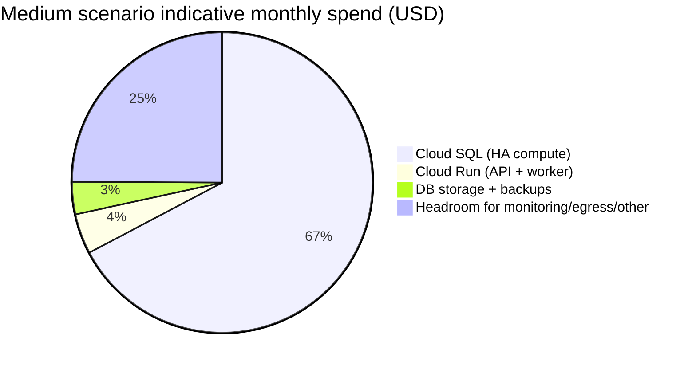

# Hosting options and pricing research for WheelchairTaxiPro in Hong Kong

## Executive summary

WheelchairTaxiPro (a web + mobile booking/dispatch style application) is best served—at least initially—by a managed compute + managed database approach in a Hong Kong region, because it reduces operational burden while keeping latency low for end users in Hong Kong. Cloud regions that natively support Hong Kong include entity["company","Amazon Web Services","cloud provider"] (region code **ap-east-1**, 3 AZs), entity["company","Google Cloud","cloud provider"] (region **asia-east2**), and entity["company","Microsoft Azure","cloud provider"] (region programmatic name **eastasia**). citeturn13search3turn21search8turn22search1

A strong “default choice” for a developer/owner team is **Google Cloud Run (containers) + Cloud SQL (PostgreSQL)** deployed in **asia-east2 (Hong Kong)**, because Cloud Run has explicit Hong Kong region availability and transparent per‑unit pricing for serverless containers. citeturn17view0turn21search8

Cost-wise, for typical booking/dispatch workloads, the **database is usually the floor cost** (especially if you choose high availability), while “serverless container” compute often remains comparatively small until very large traffic. Cloud SQL CPU/RAM pricing is explicitly metered per vCPU-hour and GiB-hour, with higher HA rates for regional (high availability) instances. citeturn20view0

Under the (stated) missing details, and using the modelling assumptions in the next section, the **indicative** monthly infrastructure spend (USD, excluding payment processing fees, SMS/telephony, Maps, and app-store fees) for a Hong Kong deployment commonly falls into these bands:

- **Small (100 users/day): ~US$150–350/month** (you can get lower if you accept single-zone DB and minimal observability; higher if you require HA, WAF, extensive logging, or a second environment).
- **Medium (5k users/day): ~US$600–1,500/month** (HA DB tends to dominate; “always warm” instances and extra environments become meaningful).
- **Large (50k users/day): ~US$1,600–5,000+/month** (scaling DB + caching + higher egress/observability; Kubernetes begins to make sense if you need platform control).

These ranges are intentionally wide because tech stack, API “weight”, DB write rate, image/file volume, and egress can swing costs materially; the report shows how. (Primary unit-rate sources used for the baseline calculations include Cloud Run pricing and Cloud SQL pricing pages.) citeturn17view0turn20view0

A practical near-term recommendation is:

- **Run the API + worker(s) on Cloud Run** (request-based billing; optionally set minimum instances for predictable latency). Cloud Run supports Hong Kong (asia-east2) and has explicit CPU/memory/request unit pricing. citeturn17view0  
- **Use Cloud SQL for PostgreSQL**, starting single-zone for MVP or **regional/HA** once you need production-grade availability. Cloud SQL is region-selectable (Hong Kong available), and its CPU/memory + storage/networking rates are explicit. citeturn16search6turn20view0  
- Add object storage + CDN, plus a small cache/queue only when you have evidence you need it (or you have real-time tracking requirements).

## Assumptions and scenario sizing

### Unspecified items (explicitly missing) and working assumptions

You have not specified: tech stack, expected traffic shape, storage growth, compliance regime, and availability targets. This report therefore uses “reasonable defaults” and shows how changing them alters costs.

**Tech stack (unspecified):** assumed to be a conventional JSON API backend with a static/SSR web frontend; mobile apps call the same API; relational database stores bookings, users, drivers, vehicles, pricing rules, and audit events.

**Traffic (unspecified):** scenarios are based on *daily active users*, but real cost drivers are requests, concurrency, DB read/write mix, and egress.

**Data storage (unspecified):** assumed to include at least: relational DB + object storage (images, documents) + logs.

**Compliance (unspecified):** treated as “handles personal data + location data”; payment card data should be offloaded to a PCI provider (e.g., hosted payments) and tokenised. (No specific legal regime is asserted here because it was not sourced in the pricing research.)

**Latency / region:** user clarified Hong Kong. Therefore, “primary region” is Hong Kong for compute + DB. Hong Kong-capable regions include AWS ap-east-1 (3 AZs), GCP asia-east2 (Hong Kong), and Azure eastasia. citeturn13search3turn21search8turn22search1

**Availability targets (unspecified):** modelled as:
- Small: “acceptable downtime” (single-zone acceptable).
- Medium: “production” (multi-zone / HA DB recommended).
- Large: “production + resilience” (HA DB + stronger separation + disciplined ops).

### Scenario model used for cost estimates

The following table translates the *user/day* scenarios into operational units that drive cost (requests, egress, storage). Replace these with your real metrics when available; the report shows the sensitivity points.

| Scenario | Users/day | API requests/user/day (assumed) | Monthly API requests (approx.) | Avg response payload (assumed) | Monthly internet egress (API only, approx.) | DB size (assumed) | Object storage (assumed) |
|---|---:|---:|---:|---:|---:|---:|---:|
| Small | 100 | 20 | 60k | 50 KB | ~3 GB | 10 GB | 20 GB |
| Medium | 5,000 | 20 | 3.0M | 50 KB | ~150 GB | 50 GB | 200 GB |
| Large | 50,000 | 20 | 30M | 50 KB | ~1.5 TB | 200 GB | 2 TB |

**How changing assumptions changes costs (the big levers):**
- If average request time doubles (e.g., heavier endpoints), serverless/container compute costs roughly double (Cloud Run is priced per vCPU-second and GiB-second during active time). citeturn17view0  
- If you require HA database early, you generally pay a meaningful uplift because Cloud SQL “HA vCPU” and “HA Memory” are billed at higher hourly rates than non-HA. citeturn20view0  
- If you keep minimum instances (“always warm”), you pay idle-time charges in addition to active time on Cloud Run request-based services. citeturn17view0  
- Kubernetes introduces a fixed cluster management fee (GKE: $0.10/cluster-hour; EKS: $0.10/cluster-hour for standard support) before you even pay for worker nodes. citeturn17view2turn15view0

## Component inventory checklist

The hosting bill is the result of multiple components, not just “a server”. For WheelchairTaxiPro, the minimum sensible inventory to consider is:

| Component | What it typically does in a wheelchair taxi / dispatch app | Cost behaviour | Notes |
|---|---|---|---|
| API servers | Auth, bookings, pricing, dispatch logic, admin | Scales with CPU + concurrency | Often easiest to containerise first |
| Web frontend | Public site + admin portal | Usually cheap if static + CDN | Can be bundled with app platform |
| Mobile backend | Usually same as API | — | Keep single backend surface area |
| Real-time features | Driver location, trip state, ETAs, chat | Can drive persistent connections | Often adds cache/pubsub/websocket infra |
| Database (relational) | Bookings, users, drivers, vehicles, payments refs | **Usually the “floor cost”** | HA is a major step-change |
| File/object storage | Images, documents, exports | Scales with GB stored + egress | Consider lifecycle + retention |
| Push notifications | Rider/driver push | Mostly free infra-side | FCM/APNs external; still needs integration logic |
| Geolocation/maps | ETA, routing, geocoding | External API costs | Typically billed per request by Maps vendor |
| Payment processing | Charges, refunds, payouts | External fees | Stripe-like fees; hosting minor |
| Background jobs | Emails, receipts, scheduled dispatch, reconciliation | Either separate worker(s) or queued jobs | On serverless you pay per execution time |
| CI/CD | Build/test/deploy | Mostly fixed tooling costs | Often GitHub Actions + registry |
| Monitoring/alerting | Logs, metrics, traces, uptime | Can balloon with high log volume | Decide retention early |
| Backups/DR | DB backups, object retention | Storage-driven | RPO/RTO targets determine spend |

## Hosting models analysis and pricing

This section covers the five requested hosting models—**IaaS (VMs), PaaS, containers/Kubernetes, serverless (FaaS + managed DB), managed app platforms**—including provider options (AWS/GCP/Azure/DigitalOcean/Hetzner plus a Hong Kong local provider option), Hong Kong availability, operational overhead, and cost ranges for the three scenarios.

For clarity: all “estimated monthly cost” bands below are **in USD**, exclude third‑party SaaS fees (payments, maps), and assume the scenario model earlier.

### IaaS using virtual machines

**Description**  
You run your own VMs for the API and (optionally) the database and cache, managing OS patches, runtime upgrades, scaling, and backups yourself.

**Suitability for WheelchairTaxiPro**  
Best if you want maximum control, can operate Linux + security patching reliably, and you are cost-sensitive at small scale. Becomes risky if you cannot commit to ops discipline.

**Recommended baseline configs**  
- Small: 1× app VM (2 vCPU, 4–8 GB) + 1× DB VM (2 vCPU, 4–8 GB).  
- Medium: 2× app VMs behind a load balancer + 1× larger DB VM + optional Redis VM.  
- Large: 4–8× app VMs + dedicated DB tier + cache + queue workers.

**Scaling approach**  
Horizontal scale app VMs; vertical scale DB VM until you hit limits; then add read replicas or move to managed DB.

**Operational overhead**  
High: patching, hardening, backups, monitoring, incident response.

**Security/compliance notes**  
You own OS + database hardening. If you can’t guarantee patch SLAs, managed DB is usually safer.

**Hong Kong region availability**  
- AWS has **ap-east-1 (Hong Kong)** with **3 AZs**. citeturn13search3  
- GCP supports Hong Kong as **asia-east2**. citeturn21search8  
- Azure supports regions including East Asia; confirm service-specific availability for your chosen SKUs. citeturn22search1  

**Indicative monthly cost bands (VM-only baseline, excluding managed DB)**  
These numbers are mainly to illustrate “compute floor” cost; storage, load balancers, and ops tooling add on top.

- AWS Hong Kong example unit-rate anchor points: *t3.medium in ap-east-1* is shown as starting around **$0.042/hour**; *t4g.small in ap-east-1* is shown around **$0.017/hour** (third-party calculator reflecting public rate data; validate in AWS Pricing Calculator for production budgets). citeturn10search5turn9search13turn12search11  
- DigitalOcean reference: a **2 vCPU / 4 GiB** Droplet is widely listed at **$24/month** (non-official commentary); DigitalOcean’s official Droplet pricing page confirms Droplets start from **$4/month** and include outbound transfer allowances depending on plan. citeturn24search11turn24search0

| Scenario | Typical VM footprint | Estimated monthly cost band (USD) | Why it lands there |
|---|---|---:|---|
| Small | 2 small VMs | ~80–250 | Mostly “always-on” VM hours + basic storage |
| Medium | 3–5 VMs + LB | ~300–900 | More redundancy + LB + bigger DB VM |
| Large | 8–15+ VMs + LB | ~1,200–4,000+ | App fleet + DB headroom + higher ops tooling |

**Where the band shifts materially**  
- Adding HA requires either multi-instance DB replication (doubling compute) or managed DB.  
- Outbound data transfer can dominate on some hyperscalers; providers like Hetzner emphasise high included traffic but do not offer Hong Kong regions (see managed app platform notes). citeturn24search2  

### PaaS for web/API apps

**Description**  
A managed runtime where you deploy code/containers and the platform handles patching, runtime upgrades, and scaling within a set of constraints.

**Suitability for WheelchairTaxiPro**  
Very good if you want faster delivery and fewer ops tasks than raw VMs, and you can accept some platform conventions.

**Provider options relevant to the requested list**  
- Azure App Service (Windows/Linux) is the canonical example in this category; it is priced by plan/instance size. citeturn22search0turn23search13  
- AWS and GCP have PaaS offerings, but for Hong Kong specifically you must confirm each service’s regional availability. (Example: AWS App Runner does **not** list ap-east-1 in its endpoints table, meaning it is not a Hong Kong-native option at time of writing.) citeturn13search1

**Recommended configs (Azure App Service illustration)**  
- Small: 1× Linux plan roughly equivalent to 1–2 vCPU / ~4–8 GB.  
- Medium: 2× instances (autoscale) + staging slot.  
- Large: multiple instances + private networking + more robust DB tier.

Azure App Service price anchors:
- Linux Premium v3 shows **P0v3 $62.05/month** and **P1v3 $124.10/month** as example plan points. citeturn23search13  
- Windows Premium v3 shows **P0v3 $120.45/month** and **P1v3 $240.90/month** as example plan points. citeturn23search2

**Operational overhead**  
Moderate: you manage application lifecycle, but not OS/runtime fleet.

**Hong Kong region availability**  
Azure regions list should be used to verify placement; service-specific “available in region” checks still matter. citeturn22search1

**Estimated monthly cost bands (PaaS compute + separate managed DB)**  
These bands assume you still need a managed database (often the cost floor).

| Scenario | Estimated monthly cost band (USD) | Main drivers |
|---|---:|---|
| Small | ~150–450 | PaaS plan + managed DB minimum |
| Medium | ~600–1,800 | Multiple instances + HA DB |
| Large | ~1,800–6,000+ | Many instances + DB scaling + observability |

### Containers with Kubernetes

**Description**  
Run containerised workloads on Kubernetes (K8s) with a managed control plane. You gain portability and fine-grained scheduling at the cost of operational complexity.

**Suitability for WheelchairTaxiPro**  
Best if you (a) already operate Kubernetes, (b) need sophisticated rollout patterns, multi-service architectures, or tight control of networking/security, or (c) expect utilisation high enough that K8s efficiency outweighs ops overhead.

**Provider options and Hong Kong considerations**
- **AWS EKS** is available and priced per cluster-hour: **$0.10 per cluster-hour** for clusters on Kubernetes versions in standard support; **$0.60 per cluster-hour** for extended support. citeturn15view0  
- **GKE** charges a flat **$0.10 per cluster-hour** cluster management fee; it also publishes an SLA and a free tier credit of **$74.40/month** per billing account (equivalent to one free Autopilot or zonal Standard cluster per month). citeturn17view2  
- **AKS**: Microsoft documentation describes tiers where Standard/Premium include an uptime SLA; Azure’s AKS pricing page lists standardised per-cluster monthly values (SLA tier). citeturn23search0turn23search3  
- **AWS region support**: EKS has service endpoints for **ap-east-1**. citeturn13search6

**Recommended cluster sizes (rules of thumb)**
- Small: 2 nodes (so you can do rolling updates without downtime).  
- Medium: 3–5 nodes with separation between API and workers.  
- Large: 6–20+ nodes, plus separate node pools and stronger network controls.

**Storage & networking**
- Expect to pay separately for worker nodes (EC2/Compute Engine/Azure VMs), block storage volumes, and load balancers; the fixed “cluster fee” is only the control plane/management portion. GKE explicitly notes compute is billed according to Compute Engine pricing for Standard node pools. citeturn17view2  
- If you choose AWS Fargate for pods rather than VM nodes, you use AWS Fargate pricing and region availability includes **ap-east-1**. citeturn13search2turn14search1

**Operational overhead**  
High: Kubernetes upgrades, cluster add-ons, security posture, build/publish pipelines, ingress.

**Estimated monthly cost bands (cluster fee + worker nodes + DB)**
Because worker node costs vary by VM type and utilisation, this is inherently a range; what is stable is the *control plane fee*:

- EKS standard support: $0.10/h ≈ $72/month baseline per cluster. citeturn15view0  
- GKE: $0.10/h baseline cluster management, with $74.40 monthly credit for one cluster in some cases. citeturn17view2

| Scenario | Typical K8s shape | Estimated monthly cost band (USD) | Notes |
|---|---|---:|---|
| Small | 1 cluster + 2 nodes + managed DB | ~250–900 | Cluster fee + minimum nodes + DB floor |
| Medium | 1 cluster + 3–6 nodes + HA DB | ~900–3,000 | HA DB + more nodes + logging |
| Large | 1–2 clusters + 8–20 nodes + HA DB + cache | ~3,000–12,000+ | Multi-env and ops tooling dominate |

### Serverless using FaaS plus managed database

**Description**  
Use functions (or serverless containers) that scale per request. Combine with a managed DB.

**Suitability for WheelchairTaxiPro**  
Excellent for early-stage and spiky workloads, if you can work within function/runtime limitations and you keep the database and integration surfaces clean.

**Provider options requested**
- AWS: Lambda + RDS/Aurora; Lambda is priced per request and execution duration/memory model; Aurora Serverless v2 capacity is billed in ACU-hours (and is supported in Hong Kong per AWS docs). citeturn14search2turn13search0turn14search19  
- GCP: Cloud Run (serverless containers) and “Cloud Run functions”; Cloud Run request-based billing has explicit unit rates and includes Hong Kong (asia-east2). citeturn17view0turn16search13  
- Azure: Azure Functions + managed SQL; Functions consumption pricing includes a free grant of 1M requests and 400,000 GB-s per month per subscription, per the pricing page. citeturn22search3  
- Azure Container Apps can act as a “serverless container” runtime; it includes free quotas (vCPU-seconds, GiB-seconds, requests) and bills per-second resource allocation and requests. citeturn23search1turn23search4

**Recommended “serverless container” baseline (GCP illustration, Hong Kong region)**
- API on Cloud Run request-based billing, 1 vCPU / 512 MiB, scale-to-zero for small; add minimum instances for medium/large to stabilise latency. Cloud Run explicitly distinguishes request-based vs instance-based billing. citeturn17view0turn16search8  
- DB on Cloud SQL for PostgreSQL (start 2 vCPU/8 GiB; scale up and enable HA as uptime requirements increase). Cloud SQL pricing explicitly meters vCPU and memory hourly, with HA rates, plus storage/backups. citeturn20view0  

**Estimated monthly cost bands (serverless compute + managed DB floor)**  
The following “baseline” is derived from Cloud Run unit pricing (CPU/memory/request) and Cloud SQL unit pricing (vCPU/memory/storage), and assumes the workload model in the earlier table. citeturn17view0turn20view0

| Scenario | Compute expectation (Cloud Run) | DB expectation (Cloud SQL) | Estimated monthly cost band (USD) |
|---|---|---|---:|
| Small | Often <US$20 unless you keep instances warm | Single-zone DB is the floor | ~150–350 |
| Medium | Tens of dollars to low hundreds | HA DB often dominates | ~600–1,500 |
| Large | Low hundreds to ~1k | HA DB + scaling dominates | ~1,600–5,000+ |

### Managed app platforms

**Description**  
Opinionated platforms that bundle builds, deployments, autoscaling, HTTPS, and sometimes databases into a simpler experience.

**Suitability for WheelchairTaxiPro**  
Strong if you want “fewest moving parts”, especially pre-revenue. Constraints appear later (advanced networking, compliance, tuning).

**Provider options requested**
- DigitalOcean App Platform pricing: static sites have a free tier; additional static apps are charged (e.g., $3/month), and outbound transfer overages exist (e.g., $0.02/GiB) per the pricing page. citeturn24search4  
- DigitalOcean Managed Databases shows explicit PostgreSQL node pricing starting around $15.15/month for 1 GiB/1 vCPU and $30.45/month for 2 GiB/1 vCPU, etc. citeturn24search1turn24search5  
- Hetzner emphasises high included traffic and low egress pricing, but **does not offer a Hong Kong region** (Singapore is their relevant Asia region), which impacts latency for Hong Kong end users. citeturn24search2turn24search26  
- “Hong Kong local provider” option: HKT markets cloud services and managed support, but pricing is typically quote-based rather than a public unit price list on the pages reviewed. citeturn25search14turn25search11  
- Regional alternative: entity["company","Alibaba Cloud","cloud provider"] provides a public ECS pricing list where “China (Hong Kong)” can be selected (useful if you want a Hong Kong region with a different hyperscaler economics profile). citeturn25search0

**Estimated monthly cost bands (managed app platform + managed DB)**  
- Small: ~US$60–250 (platform + smallest managed DB).  
- Medium: ~US$250–900 (more app containers + bigger DB and possibly HA).  
- Large: ~US$900–4,000+ (DB scaling and platform scaling, plus egress).

These bands are anchored by DigitalOcean’s published managed database prices and App Platform pricing model. citeturn24search1turn24search4

## Comparative decision matrix

The table below compresses the practical trade-offs into a small set of “shortlistable” paths for WheelchairTaxiPro in Hong Kong.

| Option | Cost profile (Small / Medium / Large) | Pros | Cons | Best-fit scenario |
|---|---|---|---|---|
| **GCP Cloud Run + Cloud SQL (HK)** | ~150–350 / 600–1,500 / 1,600–5,000+ | Low ops; scales smoothly; explicit unit pricing; Hong Kong region support | DB is still the floor cost; careful with min instances and logging | Default choice for a developer/owner team wanting HK latency |
| **Azure Container Apps + Azure SQL** | ~200–450 / 700–1,800 / 2,000–6,000+ | Serverless container ergonomics; free quotas; integrates with Azure | Azure SQL pricing/tiers can be complex; region/SKU checks needed | If you’re already Azure-first or need tightly integrated MS stack |
| **AWS ECS/Fargate + RDS/Aurora (HK)** | ~250–600 / 900–2,500 / 2,500–8,000+ | Strong ecosystem; Fargate supports ap-east-1 | AWS HK region often pricier; architecture can accrue “small line items” | If you’re already invested in AWS tooling/IAM and need HK region |
| **Kubernetes (EKS/GKE/AKS) + managed DB** | ~250–900 / 900–3,000 / 3,000–12,000+ | Maximum control; good for complex microservices | Highest ops overhead; fixed cluster fees; upgrades/add-ons | Only if you truly need K8s features or have K8s ops maturity |
| **DigitalOcean App Platform + DO Postgres (nearest region)** | ~60–250 / 250–900 / 900–4,000+ | Very simple; transparent pricing; fast setup | No Hong Kong region (latency); fewer advanced enterprise features | If latency to HK is acceptable (or you can use edge/CDN cleverly) |
| **IaaS on VMs (any provider) + self-managed DB** | ~80–250 / 300–900 / 1,200–4,000+ | Lowest platform fees; maximal flexibility | You own patching, backups, HA, DB tuning | If you can reliably operate production Linux/DB and want lowest spend |

Key price-model anchors used in this comparison include: Cloud Run per-unit pricing and region list, Cloud SQL per vCPU/memory/storage pricing, GKE and EKS cluster management fees, AKS tier/pricing references, and DigitalOcean App Platform / Managed DB pricing. citeturn17view0turn20view0turn17view2turn15view0turn23search3turn24search4turn24search1

## Recommended architecture for Hong Kong

### Recommended hosting architecture

A pragmatic production architecture for WheelchairTaxiPro in Hong Kong is:

- **Compute:** Cloud Run services (API + background worker), deployed in **asia-east2 (Hong Kong)**. Cloud Run provides explicit unit pricing for CPU (per vCPU-second), memory (per GiB-second), and requests, and explicitly includes Hong Kong as a supported region on the pricing page. citeturn17view0turn21search8  
- **Database:** Cloud SQL for PostgreSQL, starting single-zone for small, moving to **HA/regional** at medium+ availability targets. Cloud SQL pricing is explicitly metered for vCPU, memory, HA uplift, and storage/backups. citeturn20view0turn16search6  
- **Static web:** Served via object storage + CDN (provider-native). (Not costed here due to missing object/CDN unit-rates in the gathered sources; treat as a separate line item in your final estimate.)
- **Real-time updates:** Add a pub/sub or websocket layer only if driver location and trip state require it at sub-second granularity (not costed in baseline).
- **Secrets + configuration:** Use provider managed secrets; enforce least privilege.
- **Observability:** Start with metrics + error tracking; cap log retention early.

### Architecture diagram

```mermaid
flowchart TB
  U[Users (Web + Mobile)] --> CDN[CDN / Edge Cache]
  CDN --> WEB[Static Web Frontend]
  CDN --> API[Cloud Run: API Service]
  API --> DB[(Cloud SQL: PostgreSQL)]
  API --> OBJ[(Object Storage: Images/Docs)]
  API --> PUSH[Push Providers (FCM/APNs)]
  API --> MAPS[Maps/Geocoding API]
  API --> PAY[Payments Provider]

  API --> Q[Event/Task Queue]
  Q --> WRK[Cloud Run: Worker Service]
  WRK --> DB
  WRK --> OBJ

  API --> OBS[Logging/Monitoring/Alerting]
  WRK --> OBS
  DB --> BKP[Backups/Snapshots]
```

### Worked cost baseline for the recommended architecture

The following is a **worked baseline** using the earlier traffic/storage assumptions and published unit rates for Cloud Run and Cloud SQL. It is intended as a starting point; swap in your real metrics.

**Compute (Cloud Run) unit pricing used**  
Cloud Run request-based billing shows CPU active time **$0.000024 per vCPU-second**, memory active time **$0.0000025 per GiB-second**, and **$0.40 per 1,000,000 requests** (beyond free tier). It also shows idle “minimum instances” charges. citeturn17view0

**Database (Cloud SQL) unit pricing used**  
Cloud SQL (MySQL/PostgreSQL) pricing page includes dedicated-core vCPU hourly pricing (e.g., **$0.0413 per vCPU-hour**) and memory pricing (e.g., **$0.007 per GiB-hour**) plus HA rates and storage/backups hourly pricing. citeturn20view0

**Baseline configuration assumed for costing (you may change this)**
- Small: Cloud Run API scales-to-zero; Cloud SQL 2 vCPU / 8 GiB single-zone; 10 GiB SSD.
- Medium: Cloud Run min-instances = 1; Cloud SQL 4 vCPU / 16 GiB HA; 50 GiB SSD.
- Large: Cloud Run min-instances = 3; Cloud SQL 8 vCPU / 32 GiB HA; 200 GiB SSD.

**Resulting indicative monthly costs (USD)**
- Small: Cloud Run ~<$1–$20 (depending on min instances); Cloud SQL compute ~US$101; DB storage+backups ~US$2–3 → **~US$120–200** before egress/observability. citeturn17view0turn20view0  
- Medium: Cloud Run ~US$20–60; Cloud SQL HA compute ~US$405; DB storage+backups ~US$20–25 → **~US$500–900** before egress/observability. citeturn17view0turn20view0  
- Large: Cloud Run ~US$150–300; Cloud SQL HA compute ~US$809; DB storage+backups ~US$80–100 → **~US$1,100–2,000** before egress/observability and any caching/replicas. citeturn17view0turn20view0  

Because outbound internet egress, CDN, log ingestion/retention, maps usage, and SMS can each become dominant depending on the business model, the executive summary ranges deliberately add headroom above these “core compute+DB” baselines.

### Cost breakdown chart

The pie chart below illustrates a **medium scenario** “shape of spend” for the recommended architecture (Cloud SQL HA dominated), based on the unit-rate calculation approach above.



## Migration and deployment checklist and cost outlook

### Step-by-step deployment checklist

The checklist below is written as a “single developer/owner” deployment path that keeps risk down while leaving room to scale.

**Foundation**
1. Define environments: **dev**, **staging**, **prod** (even if staging is minimal).
2. Choose a baseline region: **Hong Kong** (GCP asia-east2) for prod; keep dev in same region to avoid surprise latency. (Hong Kong is listed as asia-east2 in Google Cloud locations.) citeturn21search8  
3. Establish secrets management and least-privilege IAM from day one.

**Database**
4. Stand up Cloud SQL for PostgreSQL in Hong Kong; start single-zone, then migrate to HA when availability requirements demand it. (Cloud SQL PostgreSQL is available in asia-east2; region availability is explicitly listed.) citeturn16search6  
5. Set up automated backups and retention windows; confirm backup storage pricing and retention. citeturn20view0  
6. Run migration tooling (schema + data) and validate with application read/write tests.

**Compute**
7. Containerise the API (single container image); deploy to Cloud Run with request-based billing. Cloud Run pricing provides explicit unit rates and shows request-based vs instance-based billing choices. citeturn17view0turn16search8  
8. Add a worker service (Cloud Run service or jobs) for background tasks (emails, receipts, scheduled dispatch).
9. Decide on minimum instances only after measuring cold-start impact; minimum instances have explicit idle-time pricing. citeturn17view0  

**Frontend**
10. Deploy the web frontend as static assets behind a CDN; connect custom domain and HTTPS.

**Real-time & integrations**
11. Add push notifications (FCM/APNs integration) and test delivery at scale.
12. Integrate maps and payments; keep secrets out of client apps.

**Observability and resilience**
13. Configure error reporting, SLO-style alerts, and log retention caps early (log volume is a common surprise cost).
14. Define an RTO/RPO target; if you need higher resilience, add DB HA and test failover (Cloud SQL has explicit HA pricing). citeturn20view0  

**Release discipline**
15. Add CI/CD (build, test, deploy); enforce migrations and rollbacks.
16. Run load testing approximating “medium” scenario; adjust Cloud Run concurrency and DB size.

### First-month vs ongoing cost outlook

Because first month often includes parallel environments, migration overhead, and testing, a practical budgeting rule is:

- **First month:** plan on **~1.3× to 2×** your steady-state monthly cost (staging, extra log volume, load tests, temporary overprovisioning).  
- **Ongoing:** your steady-state is typically “database floor + compute + egress + observability”.

For the recommended architecture, the baseline steady-state cost anchors used come directly from Cloud Run and Cloud SQL published unit pricing (CPU/memory/request and vCPU/memory/storage/backup pricing). citeturn17view0turn20view0  

### If your missing requirements change, what changes first

- If you require **Kubernetes** for organisational reasons, expect to add a per-cluster fee (GKE: $0.10/cluster-hour; EKS: $0.10/cluster-hour for standard support) plus worker nodes. citeturn17view2turn15view0  
- If you prefer **Azure**, you can map the same architecture to “serverless containers” using Azure Container Apps (free quotas exist; then per-second billing applies) and to K8s using AKS tiers (Standard/Premium include uptime SLA). citeturn23search4turn23search0turn23search3  
- If you need a **local Hong Kong provider** relationship (procurement, managed connectivity, on-the-ground support), HKT markets end-to-end cloud services and managed support but is typically quote-based; pair this with a hyperscaler region if you still want cloud-native primitives. citeturn25search14turn25search11  
- If cost is paramount and you can accept **non-Hong Kong** hosting regions, DigitalOcean and Hetzner can be materially cheaper, but you must accept higher latency because their commonly referenced Asia footprint is not Hong Kong-native (e.g., Singapore). DigitalOcean’s public pricing shows entry-level DB costs clearly; Hetzner emphasises traffic economics and offers Singapore load balancer pricing, but not Hong Kong. citeturn24search1turn24search26turn24search2