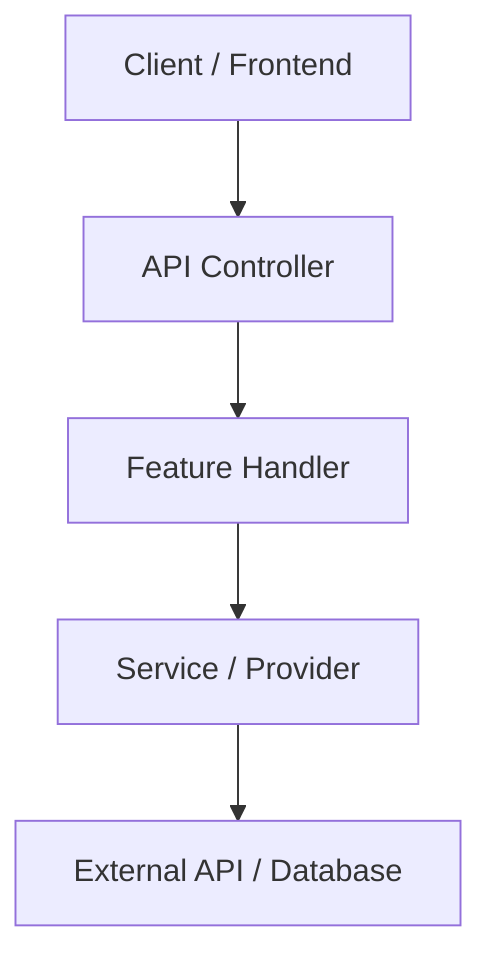
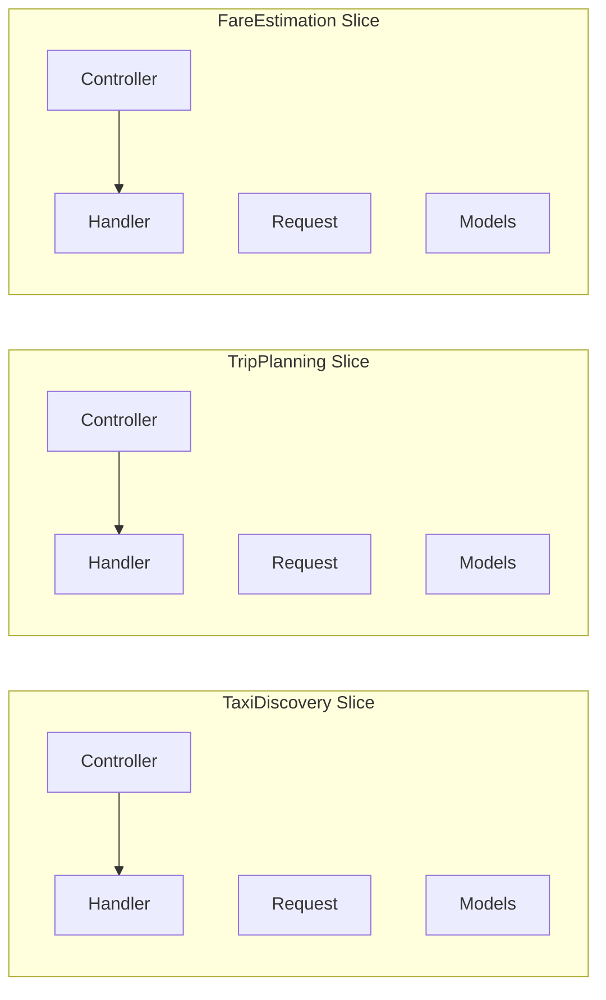
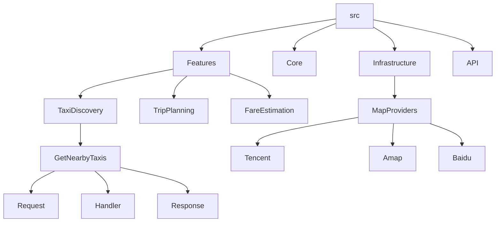
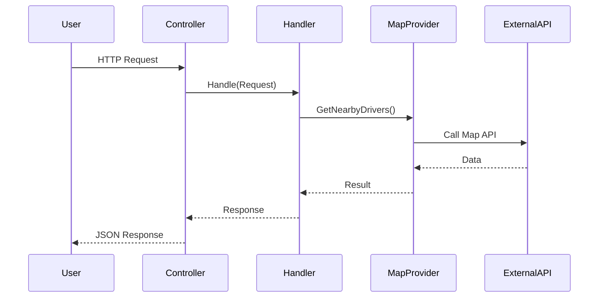
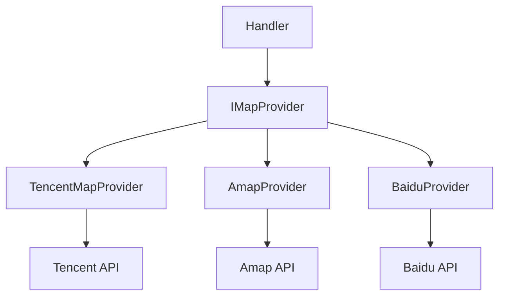
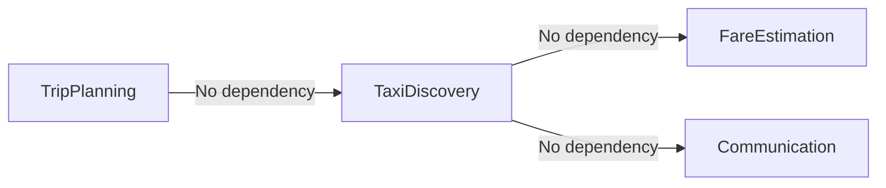
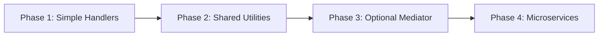

# WheelchairTaxiPro – Backend Architecture Plan (Phase 1 + Mermaid Diagrams)

## 1. Overview

This document explains the backend using **Vertical Slice Architecture** with simple handlers.

---

## 2. High-Level Structure

---

## 3. Vertical Slice Structure

---

## 4. Folder Structure (Visual)

---

## 5. Request Flow (Detailed)

---

## 6. Map Provider Strategy (Adapter Pattern)

---

## 7. Feature Independence

---

## 8. Evolution Path

---

## 9. Key Insight

Vertical Slice Architecture means:

- Each feature is self-contained
- Minimal shared logic
- Easy to extend

---

END

