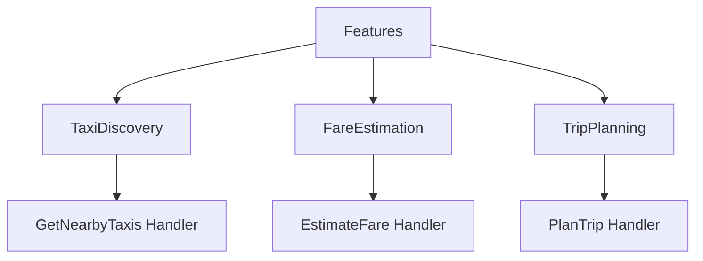
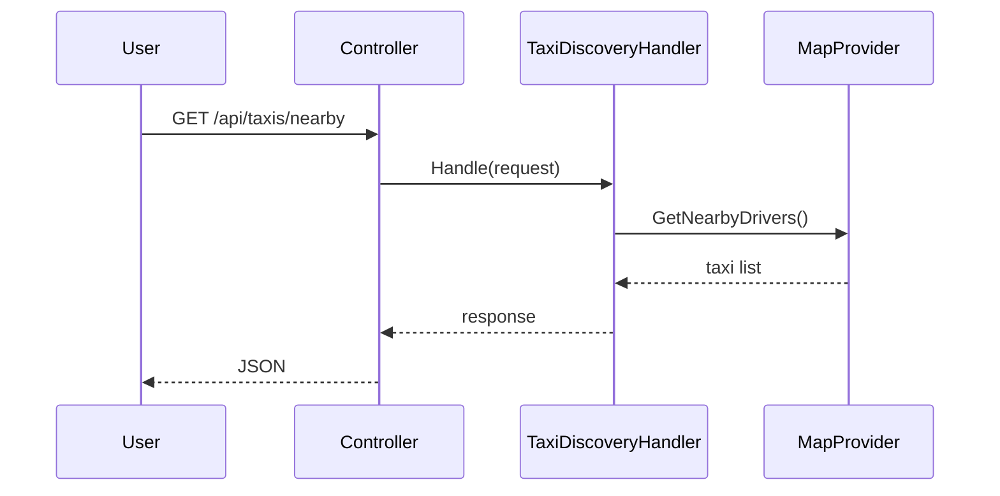

# WheelchairTaxiPro – Backend Architecture Plan (Detailed Vertical Slice Explanation)

> **Merged into:** `14-Backend-wheelchair_taxi_pro_backend_plan_v_2_no_mediat_r.md` (single backend reference). This file is kept for history or links; prefer **14-Backend** for updates.

## 1. Overview

This document explains **VERY CLEARLY** where the feature slices are and how they work in the backend.

---

## 2. What is a Feature Slice (Simple Explanation)

A **feature slice = one complete business feature**.

For example:

- "Find nearby taxis" → one slice
- "Calculate fare" → one slice
- "Plan trip" → one slice

👉 Each slice contains EVERYTHING needed for that feature.

---

## 3. Where are the Feature Slices?

👉 They are located inside:

```
src/Features/
```

---

## 4. Real Folder Structure (IMPORTANT)

```
src/
  Features/
    TaxiDiscovery/
      GetNearbyTaxis/
        GetNearbyTaxisRequest.cs
        GetNearbyTaxisHandler.cs
        GetNearbyTaxisResponse.cs
      Models/
        TaxiDto.cs

    FareEstimation/
      EstimateFare/
        EstimateFareRequest.cs
        EstimateFareHandler.cs
        EstimateFareResponse.cs

    TripPlanning/
      PlanTrip/
        PlanTripRequest.cs
        PlanTripHandler.cs
        PlanTripResponse.cs

  Infrastructure/
  Core/
  API/
```

👉 Each top-level folder under **Features/** is a slice.

---

## 5. Visual Explanation (IMPORTANT)



---

## 6. What is INSIDE a Slice?

Example: TaxiDiscovery

```
TaxiDiscovery/
  GetNearbyTaxis/
    GetNearbyTaxisRequest.cs   ← input
    GetNearbyTaxisHandler.cs   ← logic
    GetNearbyTaxisResponse.cs  ← output

  Models/
    TaxiDto.cs
```

---

## 7. How a Slice Works (Step-by-Step)



---

## 8. Key Rule (VERY IMPORTANT)

👉 Each slice should be:

- Independent
- Self-contained
- Not tightly coupled to other slices

---

## 9. What SHOULD NOT happen

❌ Don’t mix features like this:

```
Services/
  TaxiService.cs
  FareService.cs
  TripService.cs
```

👉 This is NOT vertical slice
👉 This is layer-based (avoid this)

---

## 10. Why This is Powerful

Because:

- Easy to understand (one feature = one folder)
- Easy to change (no side effects)
- Easy to scale

---

## 11. Mental Model (VERY IMPORTANT)

Think like this:

❌ "I am writing a service"

✅ "I am building the TaxiDiscovery feature"

---

## 12. Mapping to Your Frontend

| Frontend | Backend Slice |
|----------|--------------|
| map-view | MapRouting |
| taxi-discovery | TaxiDiscovery |
| trip-planning | TripPlanning |
| fare-estimation | FareEstimation |

---

## 13. Final Summary

👉 Feature slices are:

- Inside **Features/**
- Each folder = one feature
- Each feature contains its own logic

---

END

